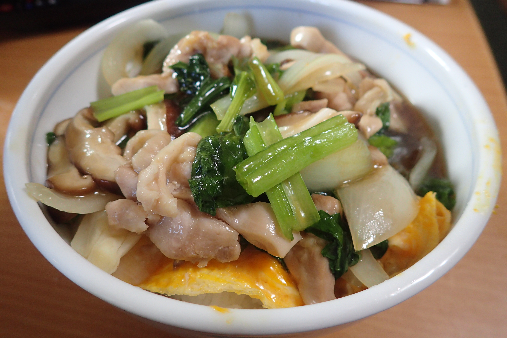

# あんかけ親子丼

## 調理時間

24分くらい

## 元ネタ

母から教えてもらった(元はどこかの料理番組らしい)。

## 食材(1人前)

* ごはん
* 鶏肉：100g前後
* 小松菜：1～2本
* きのこ類(以下のいずれか)
  * しいたけ：1本
  * しめじ：半株
  * エリンギ：1本
* たまご：2個

## 調味料

* 片栗粉：10g
* つゆ：合計130cc(以下を適当にあわせて合計130ccくらいになるように)
  * 水：80cc前後
  * かつお節だしのつゆ：30cc前後
  * みりん：20cc前後

## 調理機材

* なべ
* まないた
* 包丁
* 計量カップ
* どんぶり

## 手順

### 下準備

* 鶏肉を適度なサイズに切り分け、片栗粉をまぶす
* 小松菜ときのこを千切りにしておく
* 玉子を溶いておく
* どんぶりにご飯をよそっておく

### 調理手順

1. なべを中火で温め、暖まってきたらサラダ油を少量敷く
1. 鍋に溶いた玉子を入れ、玉子が固まってきたら箸で玉子を動かし，立体感をつける
1. 焼いた玉子をどんぶりのご飯の上によそう
1. そのままの鍋につゆを入れ、中火で温める
1. 沸騰してきたら、きのこ、小松菜、鶏肉を鍋に入れ、蓋をし、1～2分程度温める
1. 具に十分火が通ったら、どんぶりの上につゆと具をよそってできあがり

## メモ

* 親子丼は本来三つ葉だが、三つ葉は日持ちしない上に独り暮らしではあまりやすいので却下
* キノコは、人数などから適当なものを選ぶ。おすすめはしいたけ
