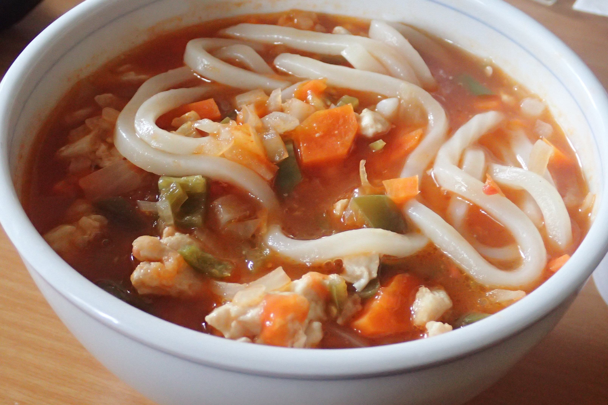

# トマトうどん

## 調理時間

40分くらい

## 元ネタ

[Cookpadレシピ](https://cookpad.com/recipe/4935732)

## 食材(1人前)

* うどん：一人前
* 鶏肉：100g前後
* トマト：ひとつ
* たまねぎ：四分の一玉
* にんじん：半分
* ピーマン：一個

## 調味料

* サラダ油
* 固形コンソメ：一個
* ケチャップ：小さじ二杯
* 水：200cc
* 水溶き片栗粉：小さじ一杯

## 調理機材

* フライパン
* まないた
* 包丁
* 計量カップ

## 手順

### 下準備

* トマトの皮を剥いて、粗くみじん切りにする
* たまねぎ・にんじん・ピーマンをみじん切りにする
* 水とケチャップ・固形コンソメを混ぜておく(★)
* うどんをほぐしておく(冷凍うどんであれば、レンジでもどしておく)

### 調理手順

1. フライパンにサラダ油を敷き、中火で鶏肉を炒める
1. 色が変わってきたら、トマト・たまねぎ・にんじん・ピーマンを加えて炒める
1. たまねぎが軽く透けてきたら、★を入れる
1. ★が沸騰してきたら火を弱火にし、10分程度煮る
1. 10分経ったら水溶き片栗粉を入れて、少し混ぜる
1. 5をうどんにかけてできあがり
