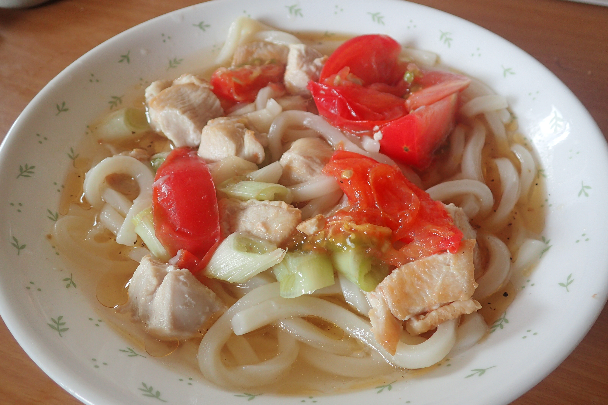

# トマトと鶏肉の冷やしうどん

## 調理時間

25分くらい

## 元ネタ

オリジナル

## 食材(1人前)

* うどん：一人前
* 鶏肉：100g前後
* トマト：ひとつ
* ネギ：半分

## 調味料

* サラダ油：少々
* つゆ
  * 白だし：20cc
  * ごま油：10cc
  * レモン汁：10cc
  * 水：60cc
* 黒こしょう：少々

## 調理機材

* フライパン
* 包丁とまないた
* 計量カップ
* ざる
* ボウル

## 手順

### 下準備

* 鶏肉を食べやすいサイズに切り分けておく
* トマトをくし切りに八等分にする
* ネギを1，2cmほどの感覚で斜め切りにする
* うどんをほぐして、冷やしておく
* つゆを混ぜ、その中に黒こしょうを少々加える

### 調理手順

1. フライパンを中火であたため、サラダ油を敷き、鶏肉を炒める
2. 片面の色が変わってきたら、ひっくり返してトマトを加える
3. トマトが柔らかくなってきたら、ネギを入れて少しかき混ぜる
4. ネギが柔らかくなってきたら、火を止めて、ざるに入れ、水で冷やす
5. 大きめの皿にうどん、つゆ、炒めた鶏肉とトマトをよそって、できあがり

## そのほか

つゆに加える水は、調理手順4でトマトを冷やした水から60ccを使うと、トマトの味がつゆに残って良いです
