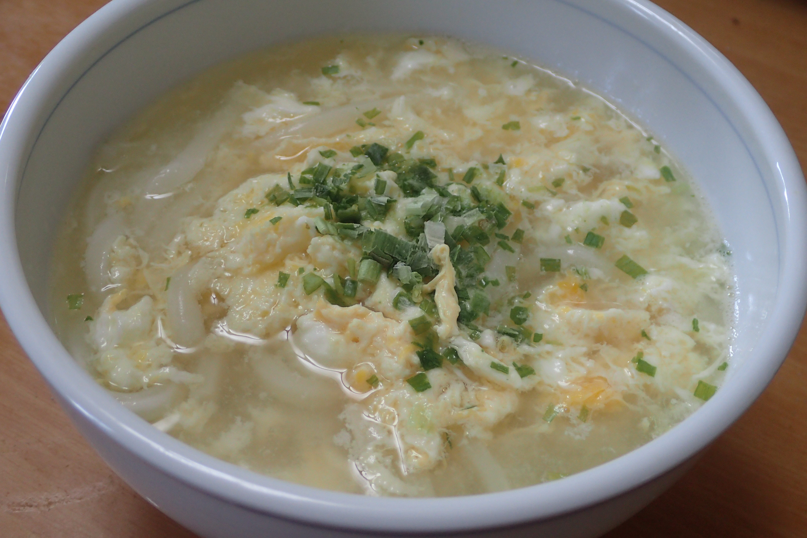

# 卵とじうどん

## 調理時間

20分前後

## 元ネタ

[卵とじうどん 作り方・レシピ \| クラシル](https://www.kurashiru.com/recipes/d1e40f3c-432b-4adc-81b1-e927ed61e8af)

## 食材(1人前)

* 冷凍うどん：一つ
* つゆ
  * 水：200ml
  * 醤油：10ml
  * 白だし：30ml
* 卵：1つ
* わけぎ：1袋

## 調味料

とくになし

## 調理機材

* 鍋

## 手順

### 前準備

* 卵を溶いておく
* 冷凍うどんを規定の時間あたため、器によそっておく

### 調理手順

1. つゆを温める
2. 沸騰してきたら、中火にして溶き卵をふんわりかける
3. たまごがかたまってきたら火を止め、器に入れる
4. わけぎを上にふりかけてできあがり
