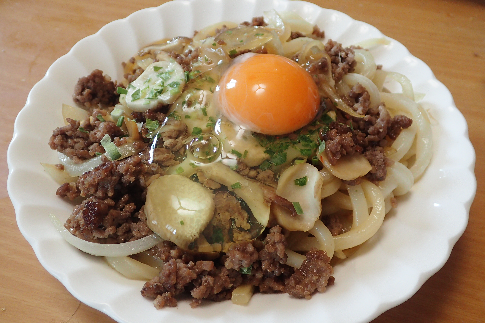

# 甘辛ミンチうどん

## 調理時間

30分程度

## 元ネタ

* [＊簡単！甘辛ミンチすき焼き風うどん＊ by ぽこべぃ 【クックパッド】 簡単おいしいみんなのレシピが309万品](https://cookpad.com/recipe/2152815)

## 食材(1人前)

* 合い挽き肉：150gくらい
* 冷凍うどん：1玉
* たまねぎ：4分の1玉
* エリンギ：1本
* わけぎ：一袋
* 卵：1個

## 調味料

* だし
  * 砂糖：大さじ1杯半
  * 醤油：大さじ2杯
  * 白だし：小さじ1杯
  * 料理酒：小さじ1杯
* 豆板醤：お好み

## 調理機材

* フライパン
* 計量カップ
* まないたと包丁

## 手順

### 下準備

* たまねぎ・エリンギを薄切りにする
* うどんはレンジであたため、戻しておく

### 調理手順

1. 中火であたためたフライパンに、合い挽き肉を入れ、炒める(油は入れない)
2. ひき肉の油がでてきたら、たまねぎとエリンギを加え、引き続き炒める
3. たまねぎとエリンギがしんなりしてきたら、だしを加えて、お好みで豆板醤を加え、混ぜる
4. うどんを加えてかき混ぜ、馴染ませる
5. お皿に盛り付け、わけぎを加え、真ん中に卵をのせて、できあがり
