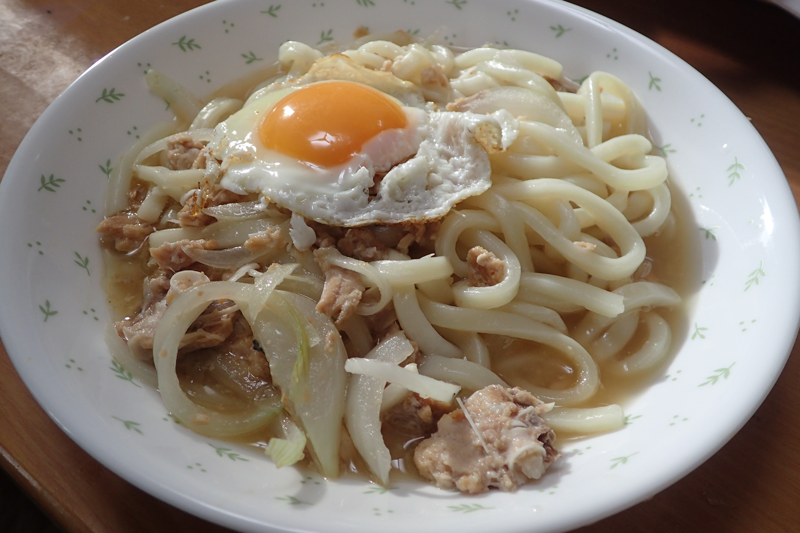

# 鮭の中骨うどん

## 調理時間

20分程度

## 元ネタ

オリジナル

## 食材(1人前)

* 冷凍うどん：1玉
* 鮭の中骨:1缶
* たまねぎ：4分の1個
* たまご：1個
* つゆ
  * 水：200ml
  * めんつゆ(3倍濃縮)：20ml

## 調味料

* 塩こしょう：少々
* サラダ油：少々

## 調理機材

* まないたと包丁
* 計量カップ

## 手順

### 下準備

* たまねぎを千切りにする
* うどんは所定の時間温めておく

### 調理手順

1. つゆを入れたフライパンを中火で温め、沸騰するまで待つ
2. つゆが沸騰してきたら、たまねぎを入れ、柔らかくなるまで待つ
3. 鮭の中骨をフライパンに加えてほぐし、その上にうどんを入れる
4. うどんがほぐれてきたら皿によそう
5. フライパンにサラダ油を敷き、卵を入れて目玉焼きを作り、うどんの上に乗せて、できあがり
