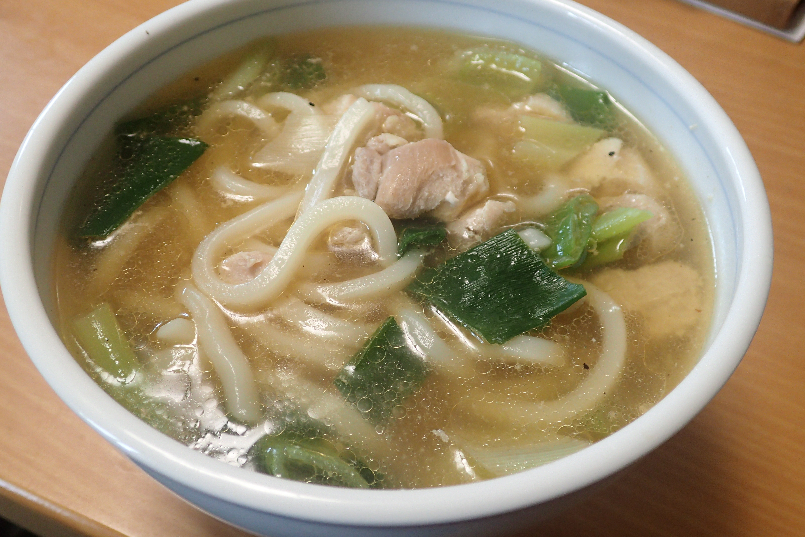

# 鶏ネギうま塩うどん

## 調理時間

25分程度

## 元ネタ

* [レシピサイト「Nadia | ナディア」](https://oceans-nadia.com/user/22780/recipe/177292)

## 食材(1人前)

* 鶏もも肉：100gくらい
* 冷凍うどん：1玉
* 長ネギ：1本
* つゆ(ベース)
  * 水：350ml
  * 鶏ガラスープの素：大さじ1杯

## 調味料

* 調味料1
  * 醤油：小さじ1杯
  * 塩：ひとつまみ
* 仕上げの調味料
  * ごま油：小さじ1杯
  * 黒こしょう：少々

## 調理機材

* 鍋
* 計量カップ
* ボウル
* まないたと包丁

## 手順

### 下準備

* 鶏もも肉を食べやすいサイズに切り分ける
* ネギを薄く斜め切りにする
* 調味料をそれぞれ混ぜ合わせておく

### 調理手順

1. 鍋につゆのベースを入れて、中火にかける
2. 沸騰してきたら鶏もも肉と長ネギを入れて、2～3分煮る
3. 調味料1を鍋に入れ、冷凍うどんを加える
4. 麺がほぐれてきたら、器にあけて、仕上げ調味料を加えて完成
