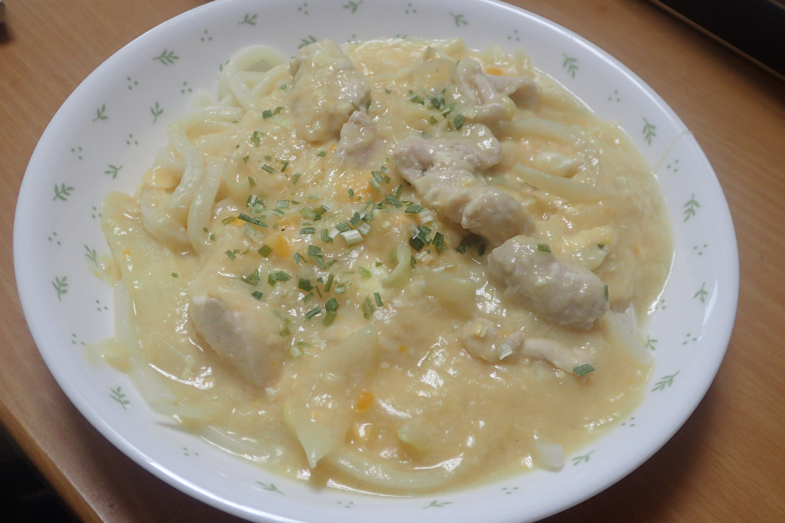

# 鶏肉とたまねぎのあんかけうどん

## 調理時間

35分程度

## 元ネタ

* [鶏肉と玉ねぎのあんかけうどん 作り方・レシピ \| クラシル](https://www.kurashiru.com/recipes/e23039f0-65af-4610-b99e-6f0f2c7d2e5b)

## 食材(1人前)

* 冷凍うどん：一つ
* 鶏肉：100gくらい
* たまねぎ：4分の1
* たまご：1つ
* つゆ
  * 水：280ml
  * めんつゆ：30ml
  * しょうがチューブ：少々
* わけぎ：一袋

## 調味料

* かたくり粉：10g

## 調理機材

* フライパン
* まないたと包丁
* 計量カップ
* ボウル

## 手順

### 下準備

* たまねぎを千切りにする
* 鶏肉にかたくり粉をまぶす
* たまごを溶いておく(つゆを入れたあとの計量カップをつかうと、ボウルを節約可能)
* 鶏肉を一口大のサイズに切り分けておく

### 調理手順

1. 色が変わってくるまで鶏肉を炒める(1分程度)
2. 鶏肉の色が変わってきたら、ひっくり返し、たまねぎを加えて炒める(1分程度)
3. つゆを入れ、溶いた卵を入れる
4. つづいて、水で溶いたかたくり粉を加える
5. 溶き卵が固まってきたら、うどんにかける
6. わけぎを加えてできあがり

## トッピング案

* 醤油を加えるといいかも
