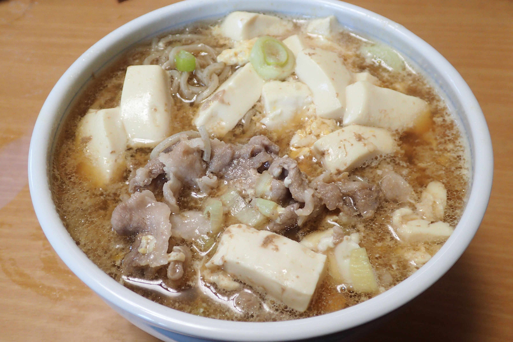

# えきめんや風すき焼きそば

## 調理時間

20分くらい

## 元ネタ

えきめんやの限定メニュー

## 食材(1人前)

* 冷凍そば：1人前
* 豚肉：100g前後
* ねぎ：2分の1本
* 豆腐：一丁
* 卵：一個

## 調味料

* つゆ：合計300cc前後を目安に好みで調整
  * 水：250cc
  * 創味のつゆ：30cc
  * みりん：20cc

## 調理機材

* なべ
* まないた
* 包丁
* ボウル(そば用の器で代用するなどして省略可能)

## 手順

### 下準備

* 卵を溶いておく
* 豆腐はさいの目状に細かく切っておく
* ネギを千切りにしておく

### 調理手順

1. 鍋につゆを入れ、中火で温める
1. 沸騰してきたら、豆腐・豚肉・ネギを入れる
1. 豚肉の色が変わってきたら、冷凍そばを入れ、そばの指定時間分あたためてふやかす
1. 溶いた卵を回し入れ、やや固まってきたらできあがり

## メモ

* 豆腐について
  * 少し小さめのほうがいいかも。
  * 片栗粉などを少しまぶしておくと良いかもしれない
  * 手に載せて包丁でさいの目にしてもいいが、形が崩れてしまうことからまないたで切ってから入れた方がいいかも
  * 豆腐を鍋に入れるタイミングについては再考の必要あり