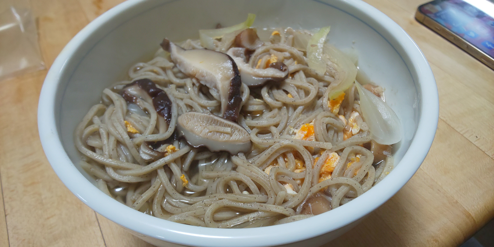

# しいたけとたまねぎの和風だしそば

## 調理時間

20分くらい

## 元ネタ

とくになし

## 食材(1人前)

* そば(使用したのは冷凍和そば)：一食分
* しいたけ：一つ
* たまねぎ：4分の1個
* つゆ：300ml
  * 水：300ml
  * ほんだし：少々
  * 昆布醤油：10ml
* 卵：1個

## 調味料

* ごま油：3，4滴

## 調理機材

* なべ
* まないた
* 包丁
* 計量カップ

## 手順

### 下準備

* たまねぎ、しいたけを短冊切りにする
* 卵を溶いておく

### 調理手順

1. 鍋につゆを入れ、中火で温める
2. 沸騰してきたら、つゆにしいたけとたまねぎを加える
3. そば麺を入れてほぐす
4. 溶き卵を回し入れ、ごま油を数滴加えて、できあがり
