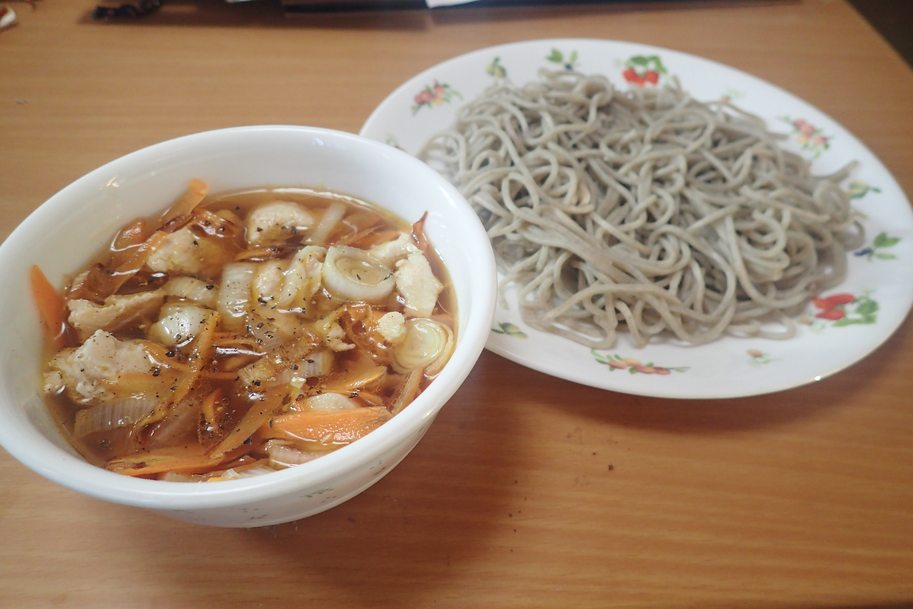

# とりにくとにんじんのつけそば

## 調理時間

30分くらい

## 元ネタ

とくになし

## 食材(1人前)

* 冷凍そば：1人前
* 鶏肉：100g前後
* ねぎ：4分の1本
* にんじん：4分の1本

## 調味料

* つゆ：合計160cc前後を目安に好みで調整
  * 水：90cc
  * かつおぶしつゆ：50cc
  * ごま油：10cc
* こしょう：一振り

## 調理機材

* フライパン
* ボウル
* 包丁(使わなくても良い)
* ピーラー

## 手順

### 下準備

* にんじんをささがきにする(包丁が難しい場合は、ピーラーで厚めに切る)
* ネギを細切りにする
* 鶏肉を一口サイズに切る
* 冷凍そばをあたため、ほぐしておく

### 調理手順

1. 鶏肉を炒める
2. 鶏肉の色が変わってきたら、にんじん、ネギ、を加える
3. 炒め終わった野菜と鶏肉を、つゆの上に載せる
4. こしょうを振って、そばを別によそってできあがり

