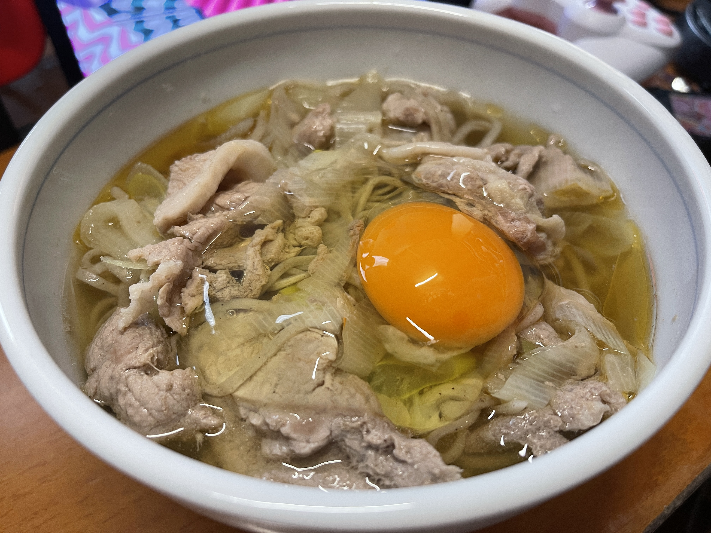

# 豚肉月見そば

## 調理時間

20分くらい

## 元ネタ

* [ほんのり甘め味♪ 豚南蛮そばのレシピ動画・作り方 \| DELISH KITCHEN](https://delishkitchen.tv/recipes/162658474696638956)

## 食材(1人前)

* 冷凍そば：1人前
* 豚肉：100g前後
* ねぎ：3分の1本
* 卵：一個

## 調味料

* しょうが：少々
* つゆ
  * 水：300cc
  * めんつゆ：50cc

## 調理機材

* なべ
* キッチンばさみ

## 手順

### 下準備

* ネギを1cm程度の間隔で斜め切りにする
* 冷凍そばを所定の時間温め、ほぐしておく
* つゆを作っておく

### 調理手順

1. 鍋につゆを入れ、中火で温める
2. 沸騰してきたら、豚肉・ネギを入れる
3. 豚肉の色が変わってきたら、しょうが、そば麺を入れる
4. 20秒ほどかきまぜてできあがり。器によそい、目玉焼きを乗せる
