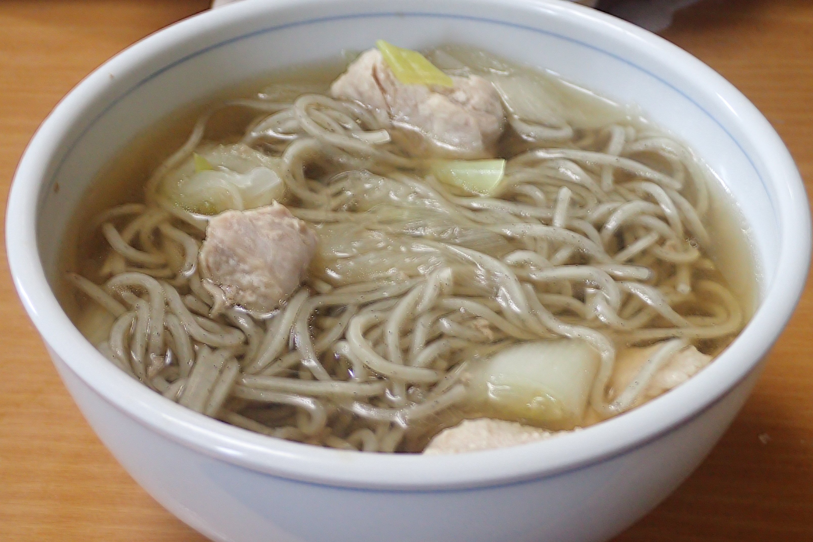

# 鶏だしそば

## 調理時間

20分くらい

## 元ネタ

* [がらスープが決め手☆簡単鶏だしそばのレシピ・作り方・献立｜【味の素パーク】の料理・レシピサイト‐レシピ大百科 : そばや鶏もも肉を使った料理](https://park.ajinomoto.co.jp/recipe/card/710089/)

## 食材(1人前)

* 冷凍そば：1人前
* 鶏肉：100g前後
* ねぎ：3分の1本～2分の1本

## 調味料

* つゆ：合計350cc前後を目安に好みで調整
  * 水：300cc
  * めんつゆ：50cc
  * 鶏ガラスープの素：少々

## 調理機材

* なべ
* 計量カップ
* キッチンばさみ

## 手順

### 下準備

* 冷凍そばを所定の時間温め、ほぐしておく
* つゆを作っておく
* ネギを1，2cm間隔の斜め切りにする

### 調理手順

1. 鍋につゆを入れ、中火で温める
2. 沸騰してきたら、つゆに鶏肉を加える
3. 鶏肉の色が変わってきたら、ねぎを加えて30秒ほど温める
4. そばを加えてすこしなじませたら、できあがり

## メモ

* 豆腐について
  * 少し小さめのほうがいいかも。
  * 片栗粉などを少しまぶしておくと良いかもしれない
  * 手に載せて包丁でさいの目にしてもいいが、形が崩れてしまうことからまないたで切ってから入れた方がいいかも
  * 豆腐を鍋に入れるタイミングについては再考の必要あり