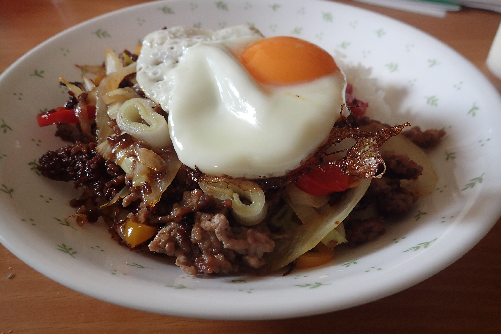

# たまねぎとパプリカのまぜ丼(α)

## 調理時間
40分くらい

## 元ネタ

[Exciteレシピ](https://erecipe.woman.excite.co.jp/detail/3cfeb80df92b3a030592ab032678971d.html)

## 食材(1人前)
- 合い挽き肉：100g前後
- パプリカ：2分の1個(赤黄両方使う場合は4分の1個ずつ)
- ピーマン：一個 or ネギ：一本
- たまねぎ：4分の1個
- たまご：一個

## 調味料
- サラダ油
- 塩こしょう
- 料理酒：小さじ二杯
- オイスターソース：小さじ二杯

## 調理機材
- フライパン
- フライ返し
- まないた
- 包丁

## 手順

### 下準備

- パプリカ・たまねぎ・ピーマン(またはネギ)を千切り。パプリカとピーマンはへたを取っておくと良いです

### 調理手順

1. サラダ油をしいたフライパンで、中火で合い挽き肉を炒める
1. 合い挽き肉の色が変わってきたらたまねぎを加える
1. たまねぎの色が透けてきたら、パプリカ・ピーマン(またはネギ)を加える。
1. ついで、料理酒とオイスターソースを加え、塩こしょうを一振り
1. ピーマンがしんなりしてきたら、火を止めフライパンの中身をご飯を盛ったどんぶりによそう
1. 卵をフライパンに割り入れ、目玉焼きを作る(蓋をするとよりしっかり焼けます)
1. 目玉焼きをどんぶりの上に乗せて完成

## トッピング案

- しめじ(かなり量が増えるので二人前以上のときに？)

