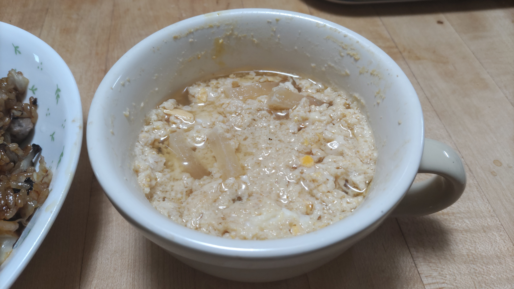

# 味噌汁茶碗蒸し

## 調理時間

10分くらい

## 元ネタ

* [残ったみそ汁を茶碗蒸しにリメイク！ by riea1130 【クックパッド】 簡単おいしいみんなのレシピが372万品](https://cookpad.com/recipe/4936185)

## 食材(1人前)

* 味噌汁の残り：150ml程度
* 卵：1個

## 調理機材

* 電子レンジ

## 手順

### 下準備

* 味噌汁の残りを耐熱容器に入れ、たまごを溶いておく

### 調理手順

1. 電子レンジを使い、600w 3分で味噌汁の残りを温める
2. 温まったら一度レンジからだしよくかき混ぜる
3. 電子レンジを使い、再度600w 1分半で味噌汁の残りを温める
4. 再度かき混ぜて出来上がり

## メモ

* 2のかき混ぜはスプーンなど厚みのあるものでしっかりかき混ぜること。菜箸などだとかき混ぜが足りず3でたまごが爆発してしまうことがある
* 容器は多少余裕のある容器を使うこと。レンジで温めるとたまごが膨張するので、容量が少ない容器を使うと吹きこぼれてしまうことがある。