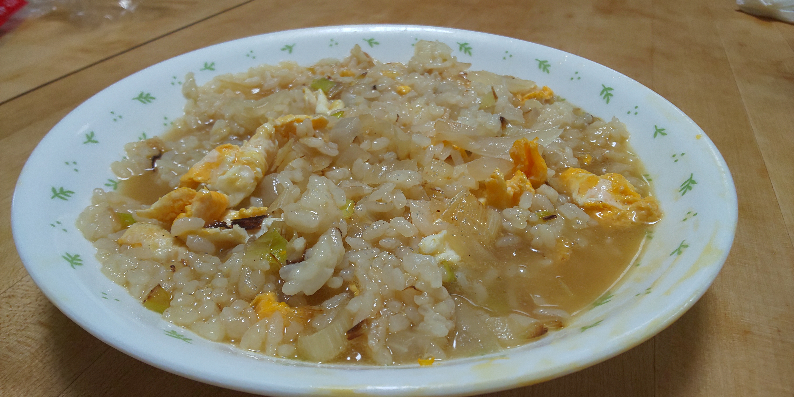

# たまねぎスープご飯

## 調理時間

20分くらい

## 元ネタ

* [夜食にオススメ！淡路島産たまねぎの「スープご飯」で心もお腹も大満足 \| くらしと](https://shop.hikaritv.net/kurashito/article/souprice.html#ttl-6)

## 食材(1人前)

* ごはん：一膳分
* たまねぎ：4分の1個
* ねぎ：5cm程度
* 卵：1個

## 調味料

* スープ
  * 水：200cc
  * コンソメキューブ：1個
* 塩こしょう：少々
* サラダ油：少々

## 調理機材

* フライパン
* まないたと包丁
* 計量カップ

## 手順

### 下準備

* ねぎをみじん切りにする
* たまねぎをみじん切りにし、スープと混ぜる

### 調理手順

1. フライパンにサラダ油を敷いて中火で温める
2. 適温になったら卵を入れてかきまぜる
3. 少し固まってきたら、ネギとご飯を加え、軽く焼き色がつくまで炒める
4. スープを加え、コンソメキューブを砕いてかき混ぜる
5. スープが温まってきたら、塩こしょうを加えてできあがり。

## メモ

* 片栗粉、を軽く入れてもいいかもしれない
