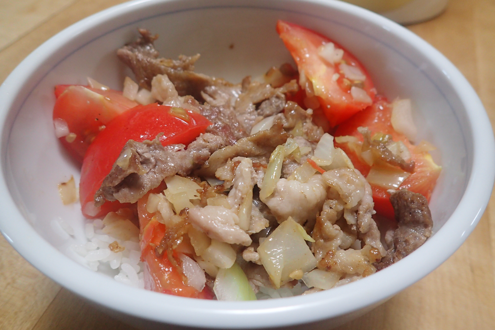

# たまねぎ塩のトマ豚丼

## 調理時間

15分くらい

## 元ネタ

オリジナル

## 食材(1人前)

* ごはん
* 豚肉：100g前後
* たまねぎ：1/4個
* トマト：1個

## 調味料

* サラダ油：少々
* つゆ
  * ごま油：20cc
  * レモン汁：10cc
  * 塩：ひとつまみ
* 黒こしょう：少々

## 調理機材

* フライパン
* 包丁とまないた
* 計量カップ
* どんぶり

## 手順

### 下準備

* トマトをくし切りに、8等分程度に切り分ける
* たまねぎをみじん切りにして、つゆにつけ、黒こしょうを少々振っておく
* どんぶりにご飯をよそっておく

### 調理手順

1. フライパンを中火であたため、サラダ油を敷き、豚肉を炒める
2. 豚肉の色が変わってきたら、トマトを加える
3. トマトが柔らかくなってきたら、つゆを加えて少し混ぜる
4. 30秒程度混ぜたら火を止め、どんぶりの上につゆと具をよそってできあがり

## メモ

* たまねぎ塩だけでも十分おいしいため、トマトがなくてもおいしい
