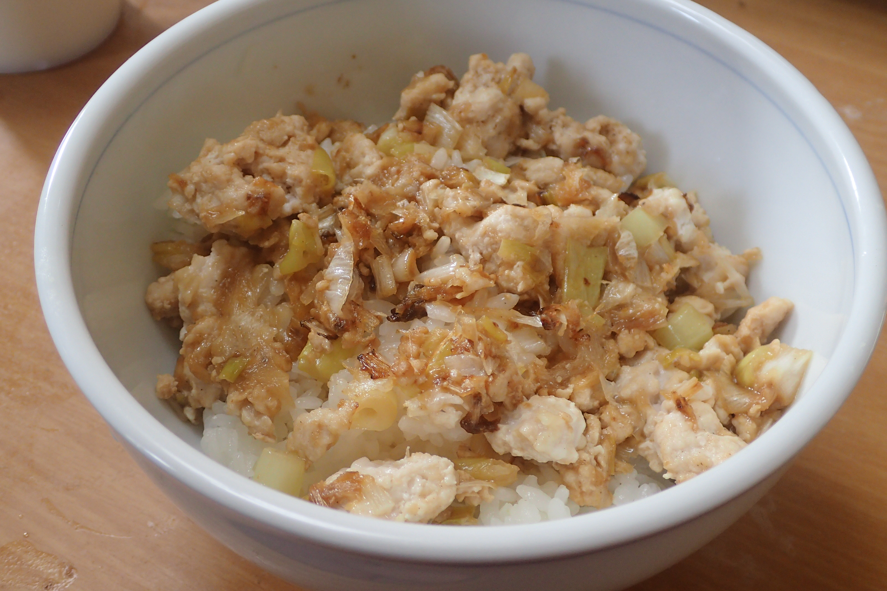

# ねぎ塩そぼろ丼

## 調理時間

30分程度

## 元ネタ

* [シンプルな ねぎ塩そぼろ丼 作り方・レシピ \| クラシル](https://www.kurashiru.com/recipes/4a518c95-03f4-42fd-a90c-e61de233b830)

## 食材(1人前)

* 鶏挽き肉：100g前後(写真は80g程度でちょっと足りない)
* 長ネギ：2分の1本
* ごはん：一膳分

## 調味料

* 下味
  * すりおろし生姜：少々
  * すりおろしニンニク：少々
* 調味料
  * 鶏ガラスープの元：少々
  * こしょう：少々
  * 醤油：少々
* ごま油：少々

## 調理機材

* フライパン
* まな板と包丁

## 手順

### 下準備

* 長ネギをみじん切りにする

### 調理手順

1. フライパンにごま油を式、下味を加え、香りが立つまで待つ(15秒程度)
2. 香りが立ってきたら、みじん切りにした長ネギをいれて中火で炒める
3. 長ネギにすこし焦げ目がついてきたら、鶏ひき肉を加えて混ぜる
4. 鶏ひき肉の色が変わってきたら、調味料を加えてさらにかき混ぜる
5. 調味料の味がちょうど良く混ざってきたら、ご飯を盛ったどんぶりによそってできあがり
