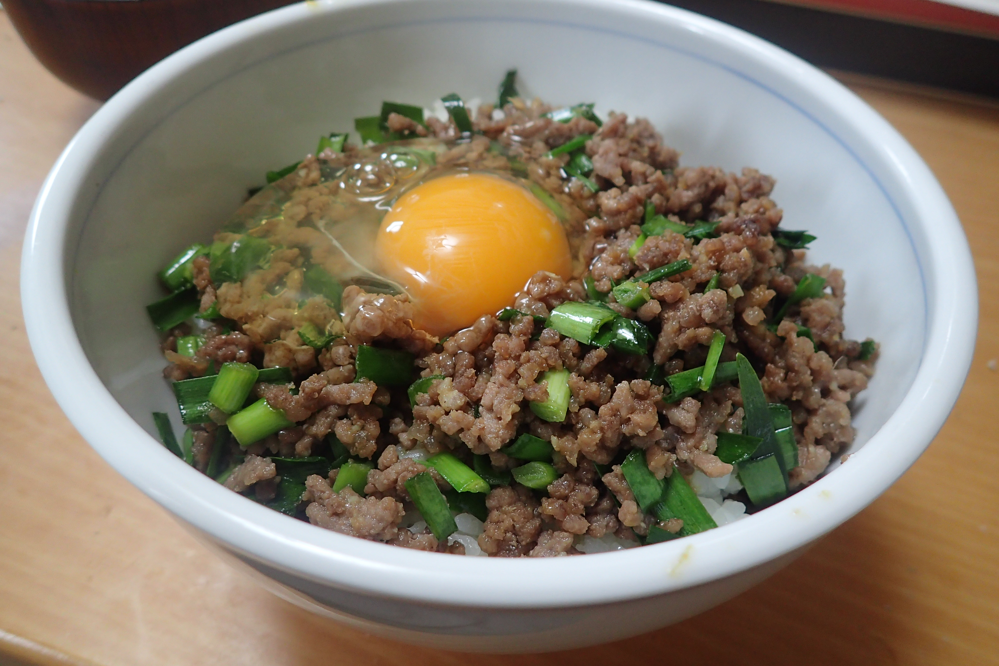

# ひき肉の簡単スタミナ丼

## 調理時間

30分程度

## 元ネタ

* [豚ひき肉とニラの簡単スタミナ丼 作り方・レシピ \| クラシル](https://www.kurashiru.com/recipes/4abb11d9-df23-443c-942a-abe9dbc3244c)

## 食材(1人前)

* 牛豚合い挽き肉：100g前後
* にら：2, 3束
* ごはん：一膳分

## 調味料

* 下味
  * すりおろし生姜：少々
  * すりおろしニンニク：少々
* 調味料
  * 醤油：大さじ一杯
  * みりん：大さじ一杯
  * 砂糖：小さじ二杯
* ごま油：少々

## 調理機材

* フライパン
* キッチンばさみ

## 手順

### 下準備

* にらを3cm程度の幅に切り分ける
* ご飯をどんぶりによそう

### 調理手順

1. フライパンにごま油をひき、下味を加え、香りが立つまで待つ(15秒程度)
2. 香りが立ってきたら、合い挽き肉を加えて中火で炒める
3. 合い挽き肉の色が変わってきたら、にらと調味料を加え、混ぜ合わせ、全体に味を馴染ませる
4. 味が馴染んできたら、どんぶりのご飯の上に乗せ、真ん中に穴を掘り、卵をのせて、できあがり
