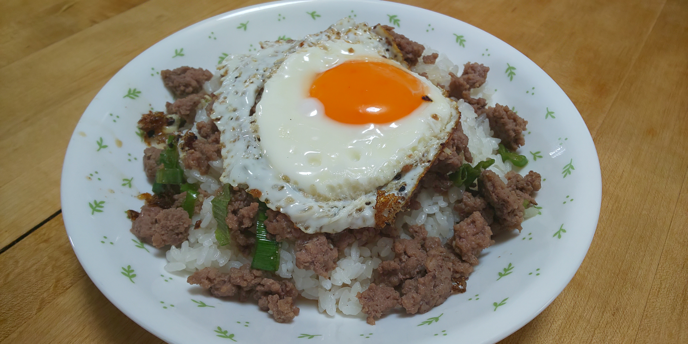

# 合い挽き肉のそぼろ丼

## 調理時間

25分程度

## 元ネタ

* [出汁をかけて激ウマ♡そぼろの出汁丼 by 鰹ふりだしモトロマン 【クックパッド】 簡単おいしいみんなのレシピが356万品](https://cookpad.com/recipe/3332990)

## 食材(1人前)

* 牛豚あいびき肉：100g前後
* ねぎ：4分の1本
* 卵：1個

## 調味料

* たれ
  * 料理酒：30cc
  * 砂糖：少々
  * かつお醤油：15cc
* サラダ油：少々
* ご飯：一杯分

## 調理機材

* フライパン
* 調理ばさみ

## 手順

### 下準備

* ネギをみじん切りにする

### 調理手順

1. フライパンにサラダ油をしき、合い挽き肉を炒める
2. 色が変わってきたら、みじん切りにしたネギを加える
3. ネギに焼き色がついてきたら、たれを加えて軽くかき混ぜ、火を止める
4. ご飯に3をのせる
5. 再度フライパンにサラダ油を多少しいて、卵を入れて目玉焼きを作る
6. 1分ほど温め固まってきたらご飯にのせて、できあがり
