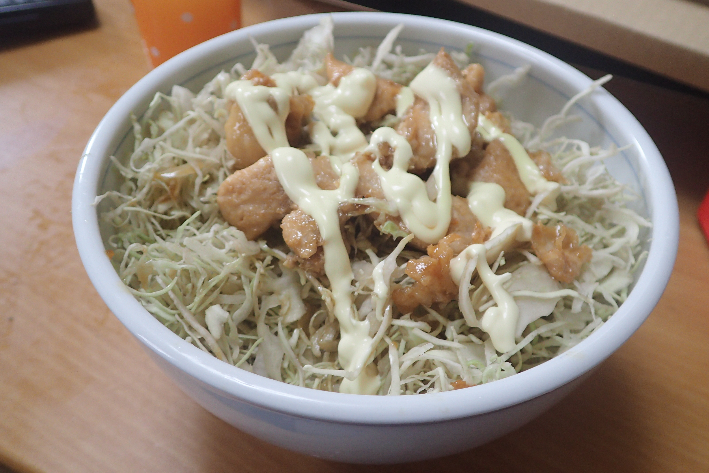

# 照り焼きキャベツ丼

## 調理時間

30分程度

## 元ネタ

*[手軽にがっつり！ 照り焼きキャベツ丼のレシピ動画・作り方 \| DELISH KITCHEN](https://delishkitchen.tv/recipes/153665116913533331)

## 食材(1人前)

* 千切りキャベツ：3分の1～2分の1袋
* 鶏肉：100g程度
* ごはん：一膳分

## 調味料

* 調味料
  * 砂糖：小さじ一杯
  * 料理酒：大さじ一杯
  * みりん：大さじ一杯
  * しょうゆ：大さじ一杯
* サラダ油：少々
* マヨネーズ：適量

## 調理機材

* フライパン
* まないたと包丁

## 手順

### 下準備

* 鶏肉を食べやすいサイズに切り分ける
* ご飯をどんぶりによそい、千切りキャベツを乗せる

### 調理手順

1. フライパンにサラダ油を敷き、鶏肉を中火で炒める
2. 色が変わってきたら、調味料を加えて4分ほど炒める
3. 鶏肉をご飯の上に乗せる
4. マヨネーズを格子状にかけて、できあがり
