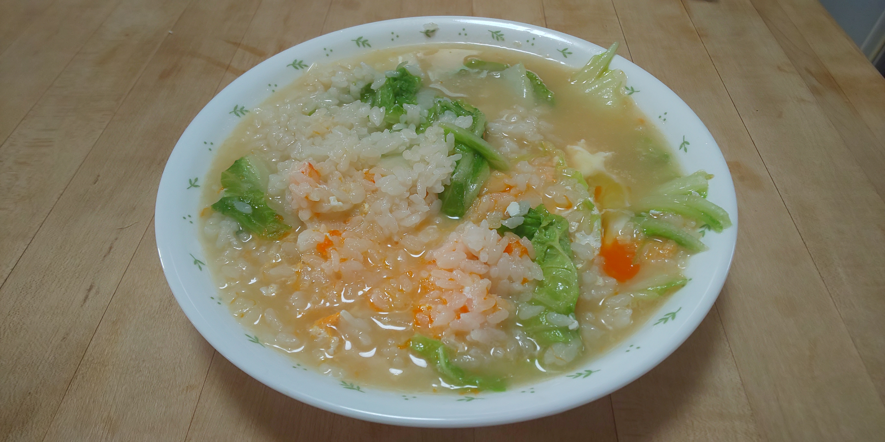

# 白菜のコンソメスープご飯

## 調理時間

15分くらい

## 元ネタ

* [レンジで5分で絶品 白菜スープ雑炊 \- しかない料理天国〜究極の節約レシピ動画〜](https://shikanairyori.com/recipe/hakusaisoupzousui/)

## 食材(1人前)

* ごはん：一膳分
* 白菜：16分の7枚
* 卵：1個
* スープ
  * 水：250ml
  * コンソメ：5gほど

## 調味料

* ごま油：3, 4滴

## 調理機材

* なべ
* 計量カップ

## 手順

### 下準備

* 白菜を一口サイズにちぎる

### 調理手順

1. なべにスープを入れて、中火で温める
2. 沸騰してきたら白菜を入れ、少し煮る、少し色が変わるまで温める
3. 溶き卵を回し入れ、ごま油を数滴加えて、できあがり
