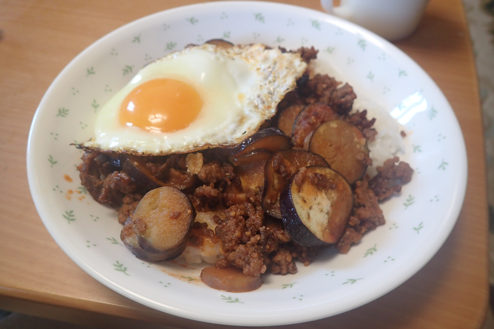

# 茄子とひき肉のボロネーゼご飯

## 調理時間

35分程度

## 元ネタ

* [クックパッド](https://cookpad.com/recipe/1448484)

## 食材(1人前)

* ごはん：一膳分
* 合い挽き肉：100g
* ナス：1個
* 卵：1個

## 調味料

* サラダ油：少々
* ベース味付け
  * ケチャップ：大さじ3杯
  * 醤油：大さじ1杯
  * 固形コンソメ：1個
* にんにく：ひとかけぶん
* 水：60ml

## 調理機材

* フライパン(蓋が閉められるもの)
* 計量カップ
* まないたと包丁

## 手順

### 下準備

* ナスを輪切りにしておく
* にんにくをひとかけ使う場合は、砕いておく(わたしはニンニクパウダーを利用しました)

### 調理手順

1. フライパンを中火で温め、サラダ油を敷き、ひき肉を炒める
2. ひき肉の色が変わってきたら、ナスを入れ、水を入れて、フライパンに蓋をし、1～2分程蒸す
3. ナスがややしんなりしてきたら、ベース味付けを加える。
4. 味に物足りなさを感じるようであれば、塩こしょうを適宜加え、よくかき混ぜる(個人的には不要でした)
5. フライパンの火を止め、あらかじめよそったご飯にかける
6. フライパンに再度少量のサラダ油を加え、目玉焼きを作る(味付けは不要)
7. 目玉焼きが固まったらご飯の上によそって完成
