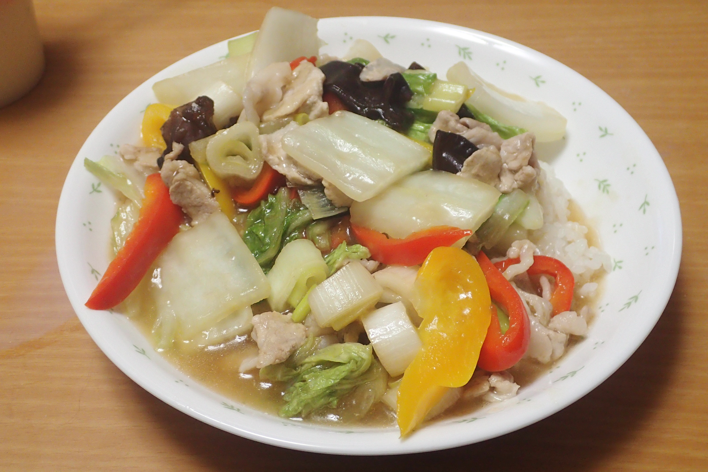

# 豚と彩り野菜の中華丼

## 調理時間

40分程度

## 元ネタ

* [DELISH KITCHEN](https://delishkitchen.tv/recipes/150506161588666842)

## 食材(1人前)

* ごはん：一膳分
* 豚肉：100gくらい
* 野菜類
  * 赤パプリカ：4分の1
  * 黄パプリカ：4分の1
  * 白菜：1枚
  * 白ネギ：1本
* つゆ
  * 水：280ml
  * 料理酒：大さじ1杯
  * 醤油：大さじ0.5杯
  * 鶏ガラスープの素：小さじ1杯
  * オイスターソース：小さじ1杯

## 調味料

* かたくり粉：10g

## 調理機材

* フライパン
* 計量カップ
* まないたと包丁

## 手順

### 下準備

* 野菜類を食べやすいサイズに切る
* つゆを作り、しっかり混ぜておく
* かたくり粉を水で溶いておく

### 調理手順

1. ごま油を敷いたフライパンに豚肉を入れて、色が変わるまで中火で炒める
2. 色が変わってきたら、野菜類を加えて野菜がややしんなりしてくるまで炒める(1分程度)
3. つゆを加えて5分程度煮る
4. 水で溶いたかたくり粉を加えて全体的にとろみが付くまでしっかり混ぜる
5. 最後にご飯によそってできあがり

## おまけ

* きくらげを追加してもおいしいです。その場合の追加手順は以下の通り
  1. 下準備の時点で、きくらげを食べやすいサイズに切り分け、つゆの中につけておく
  2. 手順3でつゆと同時にきくらげをフライパンに投入する