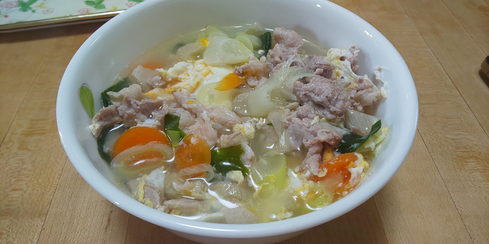

# 豚肉クッパ

## 調理時間

25分くらい

## 元ネタ

* [クッパのレシピ・作り方｜レシピ大百科（レシピ・料理）｜【味の素パーク】 : ご飯や溶き卵を使った料理](https://park.ajinomoto.co.jp/recipe/card/707839/)

## 食材(1人前)

* ごはん
* 豚肉：100g
* 長ネギ：2分の1本
* にんじん：2cm程度
* カットわかめ：少々
* 卵：1個
* スープ
  * 水：330ml
  * 鶏ガラスープの素：1包

## 調味料

* ごま油：3, 4滴

## 調理機材

* なべ
* まないたと包丁
* 計量カップ
* どんぶり

## 手順

### 下準備

* 豚肉を一口サイズに切り分ける
* ネギを薄切りにする
* ニンジンを短冊切りにする
* 玉子を溶いておく
* どんぶりにご飯をよそっておく

### 調理手順

1. なべにスープを入れて、中火で温める
2. 沸騰してきたら豚肉を入れ、少し色が変わるまで温める
3. 豚肉の色が少し変わってきたら、ネギ、にんじん、わかめを入れる
4. 溶き卵を回し入れ、ごま油を数滴加える
5. どんぶりのご飯の上に4をかけてできあがり

## メモ

* あれば白ごまなどを加えるとよい
