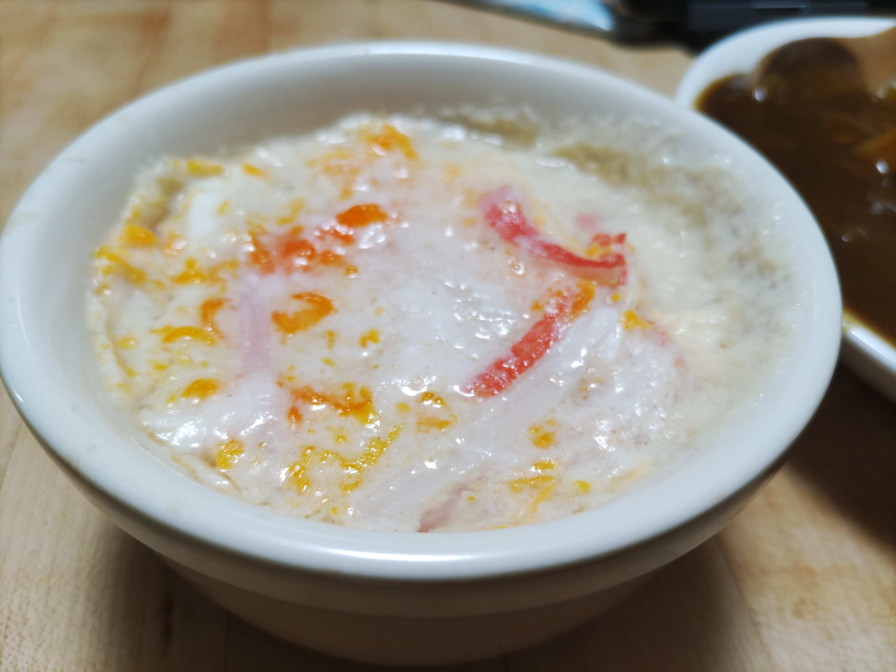

# かにかまとたまごのスープ

## 調理時間

10分程度

## 元ネタ

* オリジナル

## 食材(1人前)

* かにかま：1本
* たまご：1個

## 調味料

* スープ
  * 水：170mm
  * 鶏ガラスープの素：5g

## 調理機材

* レンジ
* 耐熱スープカップ
* スプーン(木さじ推奨)

## 手順

### 下準備

* スープを耐熱スープカップにそそぐ
* かにかまを割いて加える
* たまごをスープカップに入れて良くかき混ぜる

### 調理手順

1. 電子レンジにスープカップを入れ、500wで3分あたためる
2. スープカップを出しよくかきまぜる
3. 再度電子レンジにスープカップを入れ、500wで1分半あたためる
4. たまごが白く固まってきたらできあがり(固まっていないようであれば、固まるまで500wで10秒ずつあたためる)

## メモ

* 下準備と手順2でよくかき混ぜないとたまごが破裂することがあるので注意
* 3以降吹きこぼれることがあるのでレンジの中はときどきチェックしておくこと
