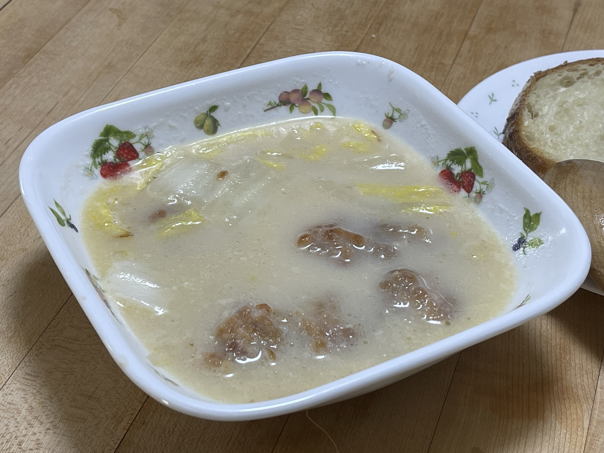

# 白菜と鶏肉のミルク煮

## 調理時間

30分程度

## 元ネタ

* [白菜と鶏肉のミルク煮 レシピ・作り方 by 所沢とっくん｜楽天レシピ](https://recipe.rakuten.co.jp/recipe/1780019922/)

## 食材(1.5人前)

* 白菜：1，2枚
* 鶏肉：100g

## 調味料

* スキムミルク：大さじ3杯
* 小麦粉：鶏肉を覆うくらい
* 鶏ガラスープの素：5g
* めんつゆ2杯濃縮：10cc
* 水：200cc
* サラダ油：少々

## 調理機材

* ボウル
* キッチンばさみ
* 鍋

## 手順

### 下準備

* 食べやすいサイズに切り分けた鶏肉に小麦粉をまぶしておく

### 調理手順

1. サラダ油を敷いた鍋を中火で温め、鶏肉を炒める
2. 鶏肉の色が変わってきたら、白菜をちぎって加える
3. 白菜が少し柔らかくなってきたら火を弱め、水、鶏ガラスープの素、スキムミルクを加え、よくかき混ぜる
4. 味が調ってきたら、お皿によそってできあがり

## メモ

* 水はもうすこし少なくても良いかも
* スープが写真のように白くならないときは、スキムミルクを足す
