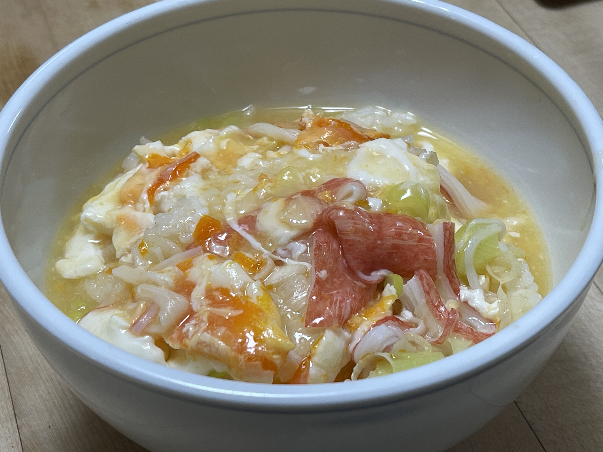

# かにかまのたまごスープご飯

## 調理時間

15分くらい

## 元ネタ

* [カニカマとねぎのスープかけごはんのレシピ・作り方｜レシピ大百科（レシピ・料理）｜【味の素パーク】 : ご飯や小ねぎを使った料理](https://park.ajinomoto.co.jp/recipe/card/801350/)

## 食材(1人前)

* ごはん：一膳分
* かにかま：12gほど
* ねぎ：5cm程度
* 卵：1個

## 調味料

* スープ
  * 水：170cc
  * 鶏ガラスープの素：5g
* 水溶き片栗粉：少々

## 調理機材

* フライパン
* キッチンばさみ
* 計量カップ

## 手順

### 下準備

* 水の中に鶏ガラスープの素を入れ混ぜておく
* 卵をといておく
* ネギをみじん切りにする
* カニカマを割いておく

### 調理手順

1. スープをフライパンに入れ、温める
2. 沸騰してきたら、ネギと水溶き片栗粉を加え、かき混ぜる
3. カニカマと卵を加え、かき混ぜる
4. 卵が固まってきたら、ご飯にかけてできあがり
