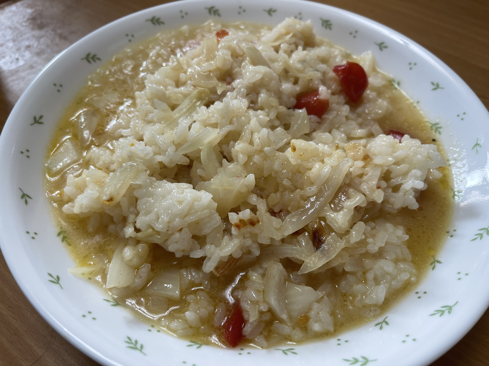

# トマトのチーズリゾット

## 調理時間

30分くらい

## 元ネタ

* [フレッシュトマトたっぷり！コク旨チーズリゾット by 楠みどり \| レシピサイト Nadia \| ナディア \- プロの料理家のおいしいレシピ](https://oceans-nadia.com/user/10254/recipe/171934)

## 食材(1人前)

* ごはん：一膳分
* プチトマト：3，4個
* たまねぎ：4分の1個

## 調味料

* ニンニクチューブ：少々
* 水：150cc
* 塩こしょう：少々
* ピザ用チーズ：ひとつかみ
* コンソメキューブ：1個
* オリーブオイル：小さじ2杯

## 調理機材

* フライパン
* まないたと包丁
* 計量カップ

## 手順

### 下準備

* たまねぎをみじん切りにする
* プチトマトを十字に切り四分割にする

### 調理手順

1. フライパンにオリーブオイルを敷いて中火で温める
2. たまねぎとニンニクを入れ炒める
3. 香りが立ってきたら水とトマトを加える
4. 温かいご飯とコンソメを入れ、箸などでコンソメを砕く。トマトを軽く潰すようにかき混ぜ、1，2分程度煮る
5. ピザ用チーズを加える
6. チーズが溶けたら塩こしょうをかけ、味を調えてできあがり

## メモ

* たまねぎとニンニクはあらかじめお皿に入れて混ぜておくと、ニンニクが撥ねるのを防げます
