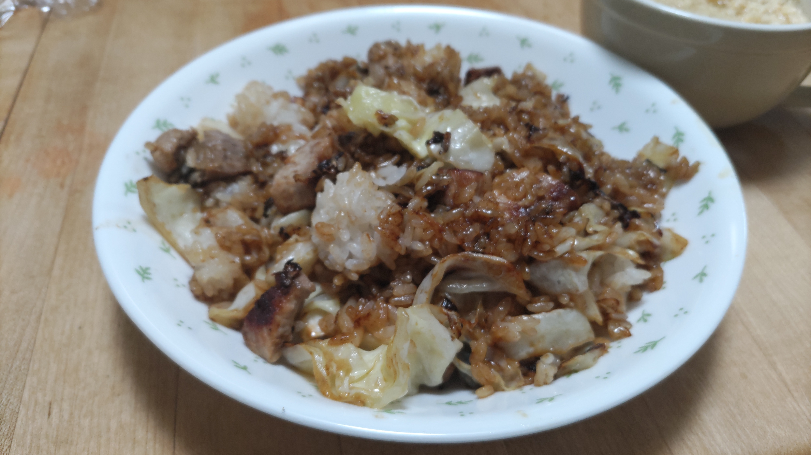

# 厚切り豚肉のキャベツチャーハン

## 調理時間

20分程度

## 元ネタ

* [豚肉のガーリック炒飯のレシピ・作り方｜レシピ大百科（レシピ・料理）｜【味の素パーク】 : 麦ご飯や豚ロースとんかつ用肉を使った料理](https://park.ajinomoto.co.jp/recipe/card/709585/)

## 食材(1人前)

* キャベツ：3分の1玉
* ごはん：1膳分
* 厚切り豚ロース肉：100～150g程度
* にんにく：1かけ

## 調味料

* 塩こしょう：少々
* 鶏ガラスープ：5g
* オイスターソース:大さじ1杯
* サラダ油：小さじ3杯程度

## 調理機材

* フライパン
* まないたと包丁

## 手順

### 下準備

* キャベツをざく切りにする
* 厚切り豚ロース肉をさいの目状に切る

### 調理手順

1. サラダ油を敷いたフライパンを中火で温め、にんにくを加える
2. 豚ロース肉を加え、色が変わるまで炒める
3. 豚ロース肉の色が変わってきたら、キャベツとご飯を加え、かき混ぜる
4. 鶏ガラスープとオイスターソース、塩こしょうをを加え、しっかり馴染むまでかき混ぜる
5. 全体にオイスターソースが馴染み、色が変わったらできあがり

## その他

参照元レシピの通り、パプリカなどを加えても良さそう