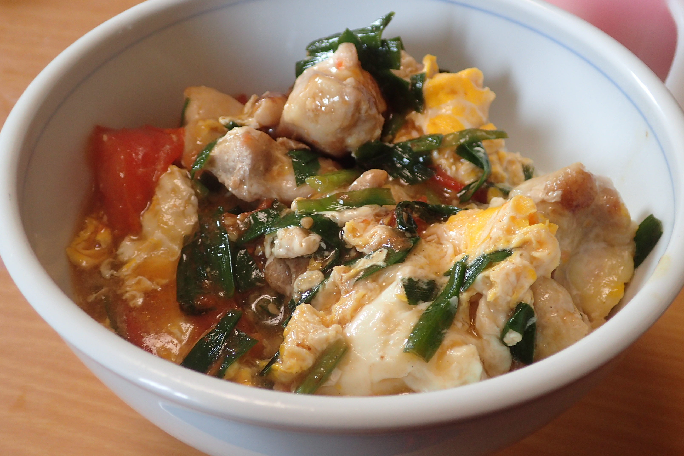

# トマトとニラのとろとろ親子丼

## 調理時間

25分程度

## 元ネタ

* [DELISH KITCHEN](https://www.kurashiru.com/recipes/07a01666-03ba-4974-b6b6-703a376e11e7)

## 食材(1人前)

* 鶏もも肉：100gくらい
* トマト：1個
* ニラ：3束ほど
* ごはん：一膳分
* 卵：一つ

## 調味料

* サラダ油：少々
* つゆ
  * お湯：100cc
  * オイスターソース：10cc
  * 塩こしょう：少々
  * 砂糖：少々
* 水溶き片栗粉：5g

## 調理機材

* フライパン
* 計量カップ
* まないたと包丁

## 手順

### 下準備

* トマトのへたを取り、食べやすくさいの目状に切る
* ニラを1cm程度に切り分ける
* 鶏肉を食べやすいサイズに切り分ける

### 調理手順

1. フライパンを中火で温め、サラダ油を敷き、鶏肉を炒める(1分程度)
2. 片面の色が変わってきた頃に、ひっくり返し、トマトを加え、さらに炒める(1分程度)
3. トマトがややとろけてきたら、ニラを加え、少しかき混ぜる
4. つゆを加えて、少し煮る(20秒程度)
5. 水溶き片栗粉を加える
6. 沸騰してきたら、溶いた卵を流し入れ、大きく混ぜる
7. 卵が固まってきたら、火を止め、器によそったごはんにかけてできあがり
