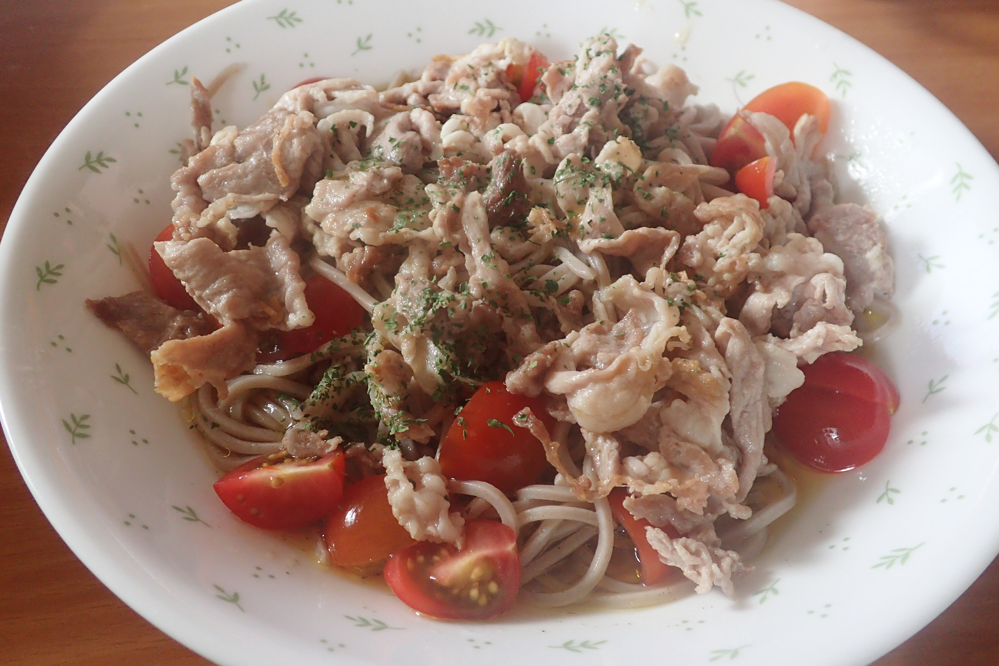

# ナスと豚肉のそば

## 調理時間

30分くらい

## 元ネタ

[クラシルレシピ](https://www.kurashiru.com/recipes/0bdedc2e-981e-439d-9b52-01758ffa668e)

## 食材(1人前)

* そば(使用したのは冷凍和そば)：一食分
* 豚肉：100g前後
* プチトマト：5個

## 調味料

* バジル：少々
* サラダ油：少々
* チューブニンニク：少々
* 塩こしょう：少々
* 水：大さじ二杯
* めんつゆ（二倍濃縮のものを利用）：大さじ三杯
* レモン汁：小さじ一杯
* オリーブオイル：小さじ一杯(×2)

## 調理機材

* ボウル(2個)
* 計量カップ
* まないた
* 包丁

## 手順

### 下準備

* めんつゆ、水、レモン汁、オリーブオイル(一回目)、チューブニンニクをかき混ぜておく(★)
* そばをほぐし、水で冷やしておく(冷凍そばであれば、レンジで温めておく)
* プチトマト5個を4等分に切っておく

### 調理手順

1. 大きめのお皿に、★を入れ、上にそば、プチトマトをよそう
1. サラダ油を敷き、豚肉を中火で炒める。
1. 豚肉の色がすっかり変わったら、火を止めて水で冷やしておく
1. 豚肉が冷えたら、1のそばの上に豚肉をよそう
1. 最後にバジルをパラパラかけて完成
