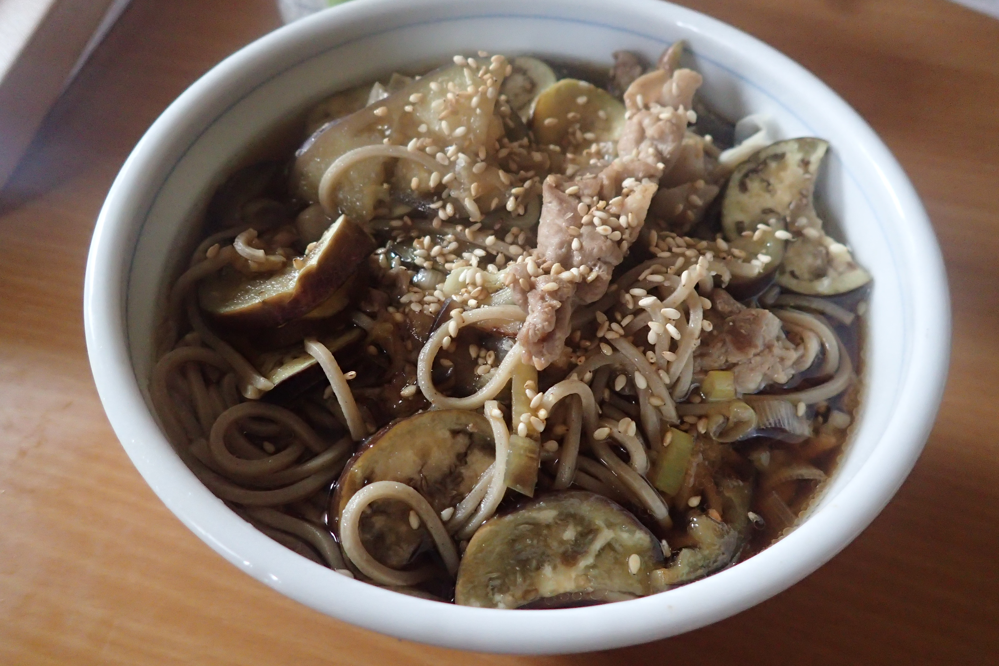

# ナスと豚肉のそば

## 調理時間

30分くらい

## 元ネタ

[Cookpadレシピ](https://cookpad.com/recipe/4218529)

## 食材(1人前)

* そば(使用したのは冷凍和そば)：一食分
* 豚肉：100g前後
* ナス：ひとつ
* ネギ：1本
* ごま：ひとつまみ

## 調味料

* ごま油：少々
* 水：300ml
* 料理酒：30ml
* みりん：30ml
* 白だし：10ml
* 醤油：40ml

## 調理機材

* フライパン
* まないた
* 包丁
* 計量カップ

## 手順

### 下準備

* ネギを2，3cmくらいの千切りにする
* ナスを乱切りにする
* 水・料理酒・みりん・白だしを上記の通りの分量で混ぜる(★)

### 調理手順

1. ごま油で豚肉・ネギ・ナスを、中火で炒める。
1. 豚肉の色が変わってきたら、★のつゆを入れる
1. ナスが少し柔らかくなってきたら、醤油と冷凍そばをいれ、弱火に。
1. 冷凍そばがほぐれてきたら、ごまを潰しながらかけて、できあがり。
