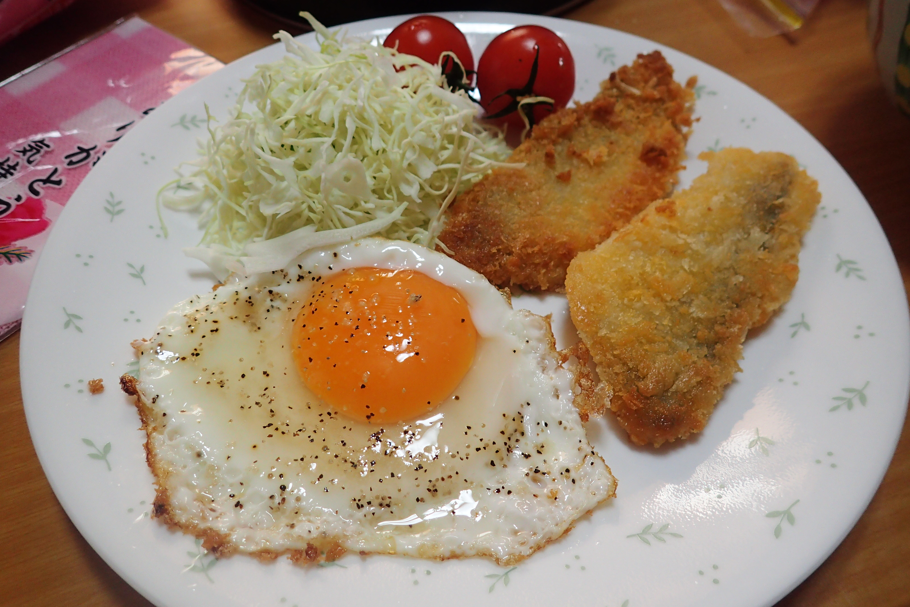

# いつもの朝ご飯

急いでいるときや、手を抜きたいときの朝ご飯。調理時間が短く、片付けも少ない

## 調理時間

20分前後

## 元ネタ

なし

## 食材(1人前)

* 冷凍惣菜など(冷凍白身魚のフライ・冷凍コロッケ・味つき鶏肉など)
* たまご：一つ
* サラダミックス：四分の一袋
* プチトマト(オプション)：2，3個

## 調味料

* サラダ油
* 塩こしょう

## 調理機材

* フライパン

## 手順

### 前準備

なし

### 調理手順

1. サラダミックスを適量、皿に盛る
1. プチトマトを水で洗い、サラダミックスに添える
1. フライパンにサラダ油をしいて、冷凍惣菜をあたためる(油で揚げるタイプの冷凍惣菜は、薄ければ袋に書かれている調理時間の半分ずつ、両面を焼くだけでも十分食べられます)。
1. あたため終わったら皿によそう
1. 目玉焼きを作る。目玉焼きが固まってきたら、塩こしょうで味付けをして、皿によそう。

## おまけ

目玉焼きを卵焼きにしても良いですが(たまごを一個プラス)、ボウルを必要があるため片付け時間が少し増えます。
たまごの黄身がつぶれてしまったら、炒り卵にしても良いでしょう。