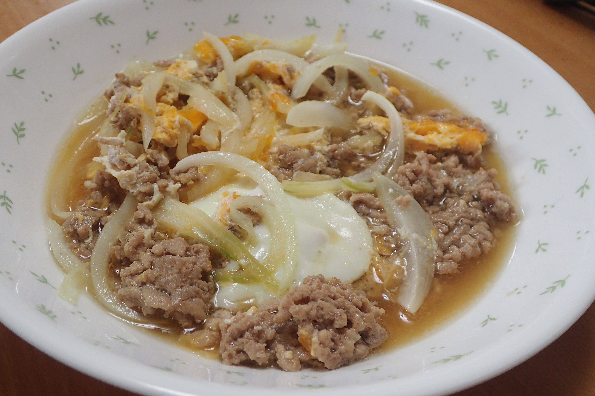

# たまねぎとひき肉の卵とじ(α)

## 調理時間

30分くらい

## 元ネタ

* [トマトとふわふわ卵のマヨソテー \| とっておきレシピ \| キユーピー](https://www.kewpie.co.jp/recipes/recipe/QP00010931/)

## 食材(1人前)

* 合い挽き肉：100g前後(豚ひき肉のほうがいいかも)
* たまねぎ：4分の1個
* つゆ
  * 水：200ml(100mlのほうがよい？)
  * ほんだし：少々
  * 醤油：10ml
  * 砂糖：少々
  * 塩：少々
* 卵：1個

## 調味料

* サラダ油

## 調理機材

* フライパン
* ボウル
* まな板と包丁
* あく取り

## 手順

### 下準備

* 卵を溶いておく
* たまねぎを細切りにする

### 調理手順

1. 鍋につゆを入れて、沸騰させる
2. 沸騰してきたらひき肉を加える
3. あくが出てきたら、あくを取り、たまねぎを加える
4. たまねぎがしんなりしてきたら、溶き卵を回し入れ、すこしかたまってきたら皿によそってできあがり
