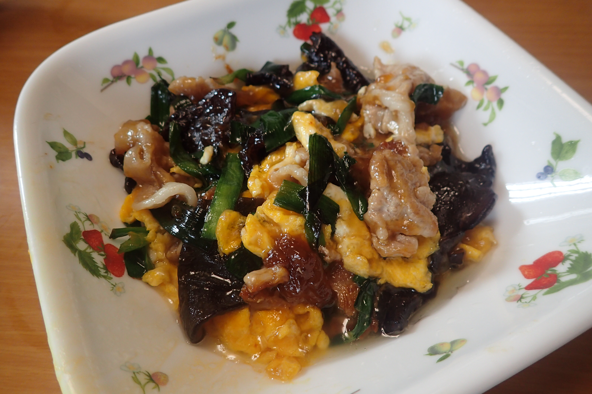

# とろーり豚ニラ玉

## 調理時間

30分くらい

## 元ネタ

[楽天レシピ](https://recipe.rakuten.co.jp/recipe/1820000215/)

## 食材(1人前)

* 豚肉：100g前後
* たまご：一個
* にら：2, 3束
* きくらげ：二枚

## 調味料

* サラダ油
* たれ
  * 醤油：大さじ0.5杯
  * 料理酒：大さじ2杯
  * みりん：大さじ2杯
  * 水：大さじ0.5杯
  * 砂糖：少々
  * 片栗粉：15g程度

## 調理機材

* フライパン
* ボウル(2個)
* キッチンばさみ

## 手順

### 下準備

* ニラを4cmほどの間隔で切り分けておく
* 卵を溶いておく
* きくらげを小さく切り分け、よくかき混ぜたたれにつけておく

### 調理手順

1. サラダ油を敷いたフライパンで溶き卵を中火で炒め、半熟になってきたらいったんお皿によける
2. 必要に応じてサラダ油を足し、豚肉を炒める。
3. 豚肉の色が十分に変わってきたら、ニラを加えて少し混ぜる(30秒程度)
4. 皿によけておいた卵をフライパンに戻す
5. たれを再度よくかき混ぜ、片栗粉が混ざったら、フライパンに入れて、かき混ぜる
6. たれが固まってきたら、お皿によそってできあがり

## トッピング案

* たれをもう少し中華風にしてもよいかも(水を除いて、鶏ガラスープの素などを加える)
