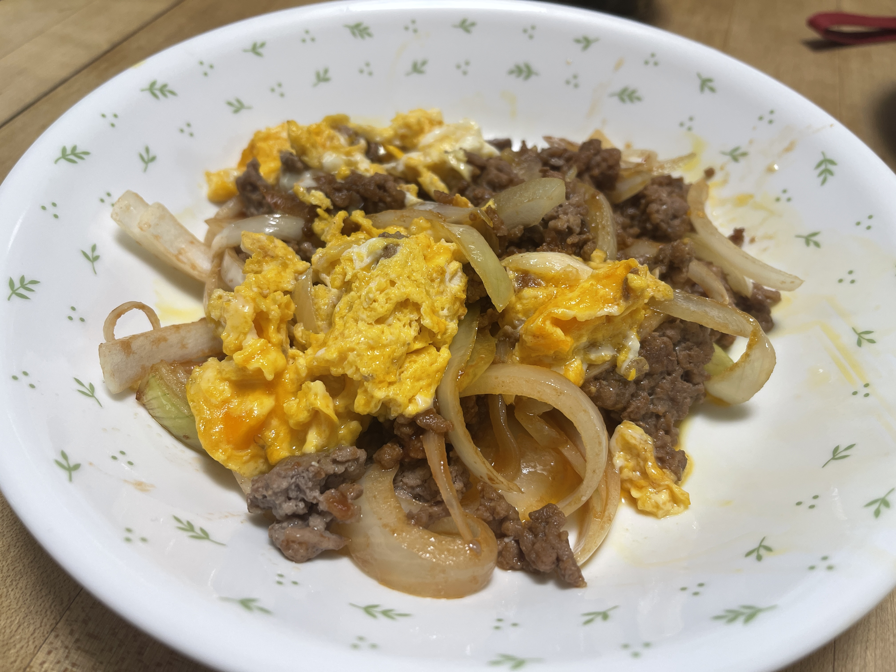

# ひき肉とたまねぎの卵炒め(β)

## 調理時間

1時間30分程度

## 元ネタ

* [＊ひき肉と新玉ねぎの洋風卵炒め＊ by 松山絵美 \| レシピサイト Nadia \| ナディア \- プロの料理家のおいしいレシピ](https://oceans-nadia.com/user/45109/recipe/385678)

## 食材(1人前)

* 牛豚合い挽き肉：100gほど
* たまねぎ：4分の1個
* 卵：1個

## 調味料

* コンソメキューブ：1個
* 醤油：小さじ1杯
* 砂糖：小さじ1杯
* トマトケチャップ：大さじ1杯
* オリーブオイル：小さじ1杯

## 調理機材

* フライパン
* まないた
* 包丁

## 手順

### 下準備

* たまねぎをくし切りにする
* 卵を溶いておく

### 調理手順

1. フライパンにオリーブオイルを敷き、中火で温める。
2. 合い挽き肉を加えて、色が変わるまで炒める。
3. 肉の色が変わりきってきたら、たまねぎを加える
4. そのまま、コンソメ、醤油、砂糖、トマトケチャップを加え、コンソメを砕く
5. 肉とたまねぎを端に寄せて、空いたスペースに卵を入れてすこしかたまるまで炒める。
6. 卵がすこしかたまってきたら、お皿によそってできあがり

## メモ

* たまねぎはシャキシャキ感を残すためにもあとでフライパンに入れる。入れたらその先の手順を手早く済ませること
* コンソメは溶けにくいので顆粒のコンソメの方が良いかも
