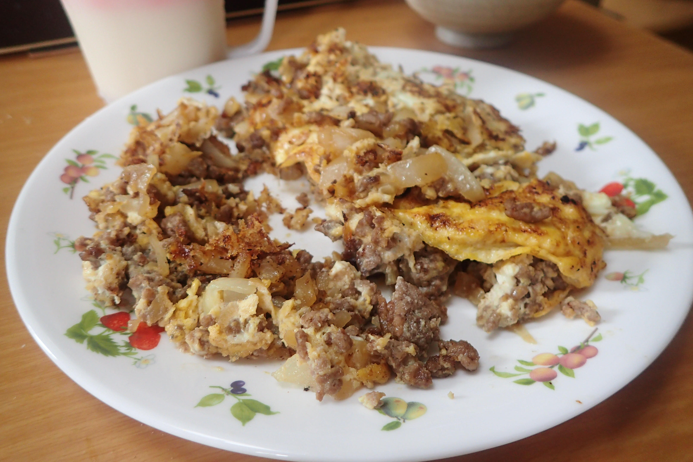

# ひき肉と玉ねぎのオムレツ(α)

## 調理時間

30分くらい

## 元ネタ

* [ひき肉と玉ねぎのオムレツ｜だいどこログ\[生協パルシステムのレシピサイト\]](https://daidokolog.pal-system.co.jp/recipe/4806)

## 食材(1.5人前)

* 合い挽き肉：100g前後
* たまねぎ：4分の1個
* 卵：2個(3個の方がいいかも)

## 調味料

* サラダ油：少々
* 調味料
  * ソース：大さじ1
  * 醤油：小さじ2分の1杯
  * こしょう：少々

## 調理機材

* フライパン
* ボウル
* まな板と包丁

## 手順

### 下準備

* 卵を溶いておく
* たまねぎを粗いみじん切りにする

### 調理手順

1. フライパンにサラダ油を敷き、中火でひき肉と玉ねぎを炒める
2. つづいてすぐに調味料を加え、水気が飛ぶまで炒める
3. 卵をぃわえて混ぜながら半熟になるまで動かす
4. 卵の底がかたまってきたら、半分に折ってお皿によそい、できあがり
