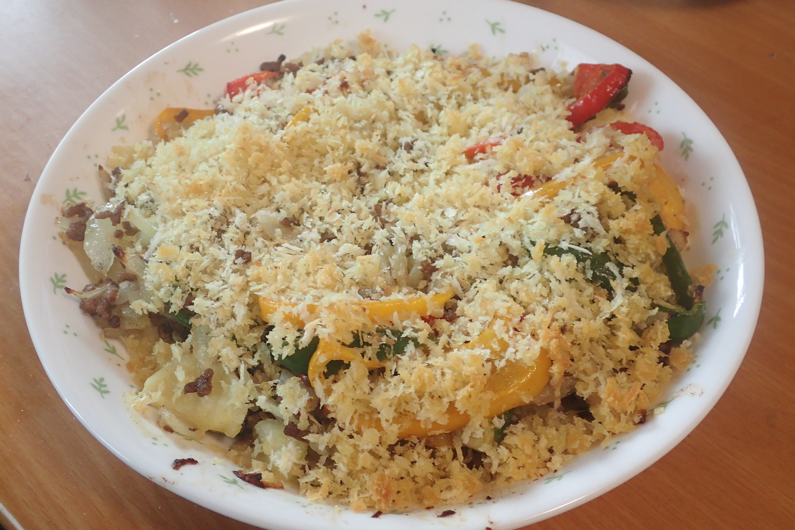

# スコップコロッケ

## 調理時間

1時間30分程度

## 元ネタ

図書館で読んだレシピブック(タイトル不明)

## 食材(1.5人前)

* じゃがいも：大きめ二つ
* たまねぎ：二分の一玉
* ピーマン：一個
* パプリカ：一個
* ひき肉(牛豚合い挽き肉がいいです)：130g前後
* パン粉：66g程度(もう少し多い方がいいかも？研究中)

## 調味料

* 塩こしょう：少々
* サラダ油
* オリーブオイル：大さじ一杯ほど

## 調理機材

* フライパン
* まないた
* 包丁
* ピーラー(ジャガイモの皮むき)
* フォークなどジャガイモを潰せるもの
* ボウル
* 耐熱皿
* オーブンレンジ

## 手順

### 下準備

* パン粉にオリーブオイルを振って混ぜておく
* じゃがいもをつぶしておく
   1. 皮をむき、半月切りにする
   1. 耐熱皿に入れ軽くラップをして6分ほど温める
   1. 熱いうちにフォークなどで潰しておく
* たまねぎをみじん切り、ピーマンとパプリカを千切りにする

### 調理手順

1. フライパンにサラダ油をしき、たまねぎ、ピーマン、パプリカを投入
1. 少ししんなりしたらひき肉を投入
1. ひき肉の色が全て変わってきたあたりで火を止めて、フライパンに触れるくらいまで冷ます(6分程度)
1. 潰したジャガイモと先ほどのひき肉を混ぜて、偏りがないようよく混ぜ、塩こしょうで味を調える
1. その上にオリーブオイルをまぶしたパン粉をジャガイモが隠れるようにかける
1. オーブンで12～20分ほど温める

## おまけ

* オーブンで温めている間に調理器具などの片付けを行い片付け時間を短縮可能