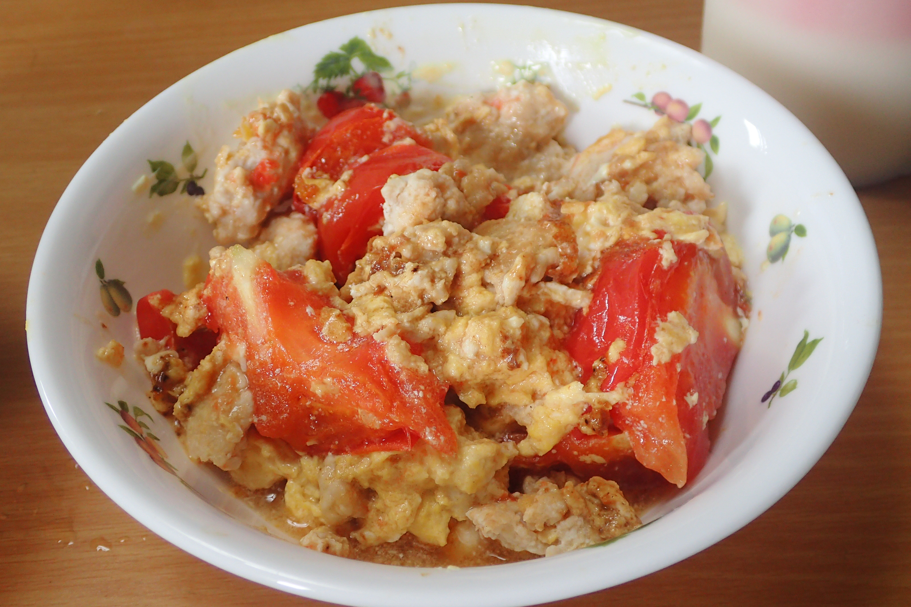

# トマトとふわふわ卵の鶏マヨソテー

## 調理時間

30分くらい

## 元ネタ

* [トマトとふわふわ卵のマヨソテー \| とっておきレシピ \| キユーピー](https://www.kewpie.co.jp/recipes/recipe/QP00010931/)

## 食材(1人前)

* 鶏ひき肉：100g前後
* たまご：一個
* トマト：一つ

## 調味料

* サラダ油
* マヨネーズ：大さじ2杯
* 塩：少々
* 黒こしょう：少々

## 調理機材

* フライパン
* ボウル
* まな板と包丁

## 手順

### 下準備

* 卵を溶き、マヨネーズを大さじ1杯ほど加えて混ぜる
* トマトを8等分程度のくし切りにする

### 調理手順

1. フライパンにサラダ油を加えて卵を炒め、半熟になったら一度皿に取り出す
2. マヨネーズを大さじ1杯入れてあたため、鶏ひき肉を加え中火で炒める
3. 鶏ひき肉の色が変わってきたら、トマトを加える(1分程度)
4. トマトが柔らかくなってきたら、1をフライパンに戻してさっといため、塩を加えて味を調える
5. 皿に盛り付け、黒こしょうをすこし振ってできあがり
