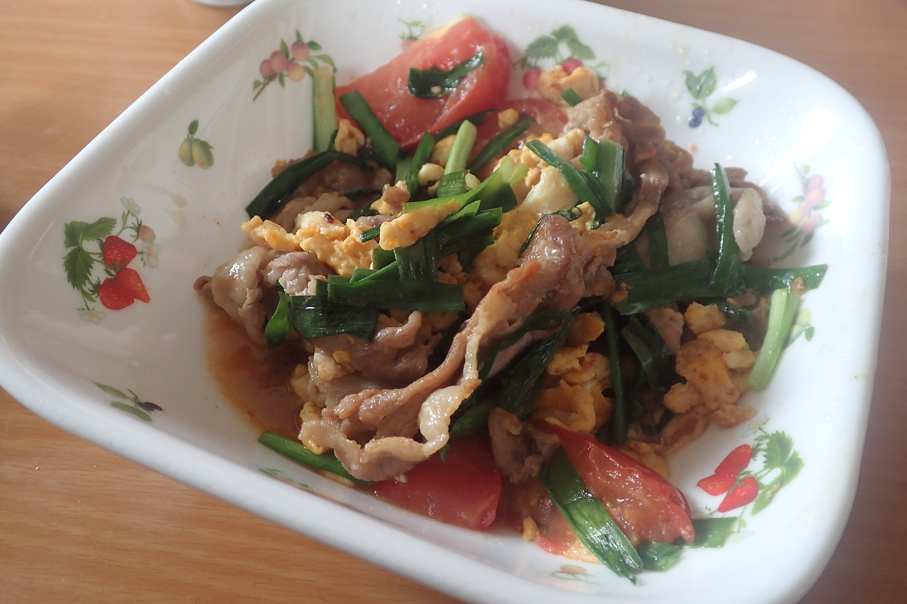

# トマトと卵の炒め物

## 調理時間

20分くらい

## 元ネタ

[Cookpadレシピ](https://cookpad.com/recipe/4191597)

## 食材(1人前)

* 豚肉：100g前後
* トマト：ひとつ
* ニラ：2，3束
* 卵：一個

## 調味料

* ごま油
* 醤油：小さじ一杯
* 料理酒：小さじ一杯
* 牛乳：20ml

## 調理機材

* フライパン
* まないた
* 包丁
* ボウル

## 手順

### 下準備

* 牛乳と卵をまぜ、溶いておく
* トマトを8等分程度にカットしておく
* にらを3cmほどに切っておく

### 調理手順

1. ごま油で豚肉を、中火で色が変わるくらいまで炒め、一度皿にあける
1. そのフライパンで溶き卵を炒め、炒り卵にして皿にあける
1. ごま油を足し、中火でトマトとにらを1分くらい炒める
1. 1と2をフライパンに戻し、醤油と料理酒を入れる
1. かきまぜて、1分ほどでできあがり
