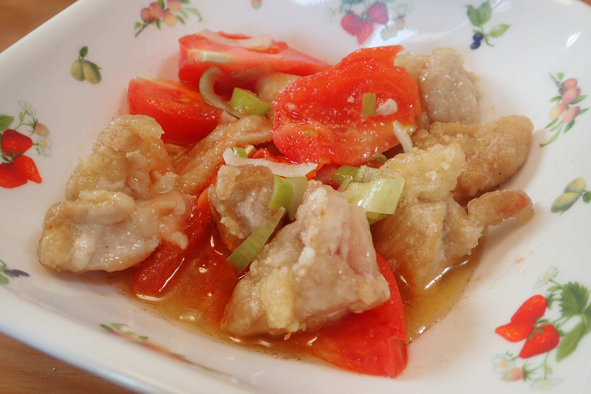

# トマトと鶏肉のネギ塩炒め

## 調理時間

25分程度

## 元ネタ

* [DELISH KITCHEN](https://delishkitchen.tv/recipes/200521526435382399)

## 食材(1人前)

* 鶏もも肉：100gくらい
* トマト：1個
* ネギ塩だれ
  * ネギ：2分の1個
  * 料理酒：大さじ2杯
  * ごま油：小さじ1杯
  * 塩：小さじ2分の1杯
  * こしょう：少々

## 調味料

* サラダ油：少々
* かたくり粉：15g

## 調理機材

* フライパン
* 計量カップ
* ボウル
* まないたと包丁

## 手順

### 下準備

* トマトのへたを取り、8等分する
* 鶏肉を食べやすいサイズに切り分け、かたくり粉をまぶす
* ネギをみじん切りにし、他のタレの材料を混ぜてネギ塩だれを作る

### 調理手順

1. フライパンを中火であたため、サラダ油を敷き、鶏肉を炒める
2. 鶏肉に火が通ったら、トマトを入れて、1分ほど炒める
3. ネギ塩だれを混ぜて、10秒ほどさっと炒めてできあがり
