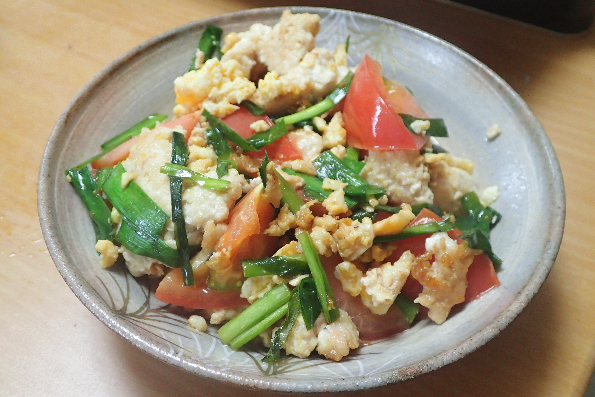

# トマト入り鶏ニラ玉

## 調理時間

30分程度

## 元ネタ

* [トマトニラ玉炒め レシピ・作り方 by メリッコ｜楽天レシピ](https://recipe.rakuten.co.jp/recipe/1370012684/)

## 食材(1人前)

* 鶏ひき肉：100g前後
* たまご：一個
* にら：2, 3束
* トマト：一つ

## 調味料

* 鶏ガラスープの素：少々
* 塩：少々
* 料理酒：小さじ2杯
* サラダ油：少々

## 調理機材

* フライパン
* 包丁
* まないた
* ボウル

## 手順

### 下準備

* 卵を溶き、鶏ガラスープの素と塩を入れる
* トマトを8等分程度にカットしておく

### 調理手順

1. サラダ油で卵を炒め、かたまってきたら一度皿に取り出す
2. サラダ油で鶏ひき肉を炒める
3. 鶏ひき肉の色が変わってきたら、トマトを加える(1分程度)
4. トマトがやや柔らかくなってきたら、ニラを加え、料理酒を入れる
5. 最後に1の卵を加えて炒めて、できあがり
