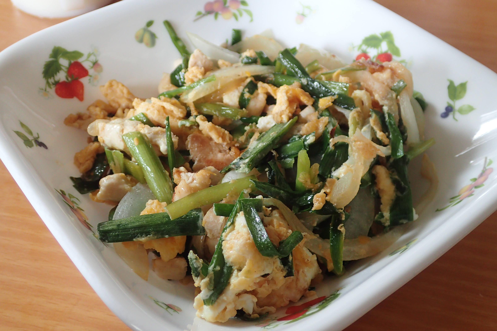

# ニラと鶏もも肉さっぱり炒め

## 調理時間

30分くらい

## 元ネタ

[Cookpadレシピ](https://cookpad.com/recipe/4901470)

## 食材(1人前)

* にら：4束ほど
* 鶏もも肉：100g程度
* 卵：一個
* たまねぎ：4分の1玉

## 調味料

* サラダ油
* 鶏ガラスープの素：小さじ1杯
* 塩こしょう：少々
* ポン酢：大さじ1杯

## 調理機材

* フライパン(ふた付き)
* まないた
* 包丁
* ボウル
* 計量カップ

## 手順

### 下準備

* 卵を溶いておく
* にらを3cmほどに切っておく(溶いた卵の上にかけておいてもよい)
* たまねぎを千切りにする
* 鶏もも肉を一口サイズに切り分ける

### 調理手順

1. サラダ油で鶏肉とたまねぎを炒める
1. 鶏肉の色が変わってきたら、ニラと卵を上にかけ、軽くかき混ぜ、フライパンにふたをして1分程度炒める
1. 塩こしょうと鶏ガラスープをかけて30秒ほど炒める
1. ポン酢を入れて火を止め、かき混ぜて30秒ほどそのままにして、できあがり
