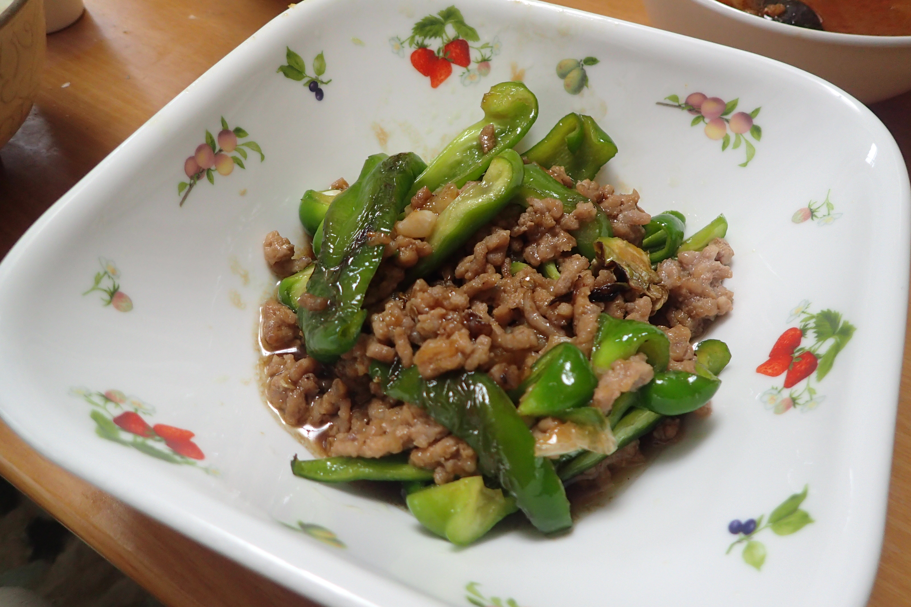

# ピーマンとひき肉のオイスターソース炒め

## 調理時間

30分程度

## 元ネタ

* [ピーマンとひき肉のオイスターソース炒め by 庭乃桃 \| レシピサイト Nadia \| ナディア \- プロの料理家のおいしいレシピ](https://oceans-nadia.com/user/26/recipe/130103)

## 食材(1人前)

* 合い挽き肉：100g程度
* ピーマン：2個
* ねぎ：10cm程度

## 調味料

* 生姜チューブ：少々
* ニンニクチューブ：少々
* 味付け
  * オイスターソース：大さじ1杯
  * みりん：大さじ1杯
  * 料理酒：大さじ0.5杯
  * こしょう：少々
* サラダ油：少々
* ごま油：少々

## 調理機材

* フライパン
* まないたと包丁

## 手順

### 下準備

* ピーマンを縦に四つ割りにする
* ネギを細切りにする

### 調理手順

1. サラダ油を敷いたフライパンを中火にかけピーマンを入れ、焼き色がつくまで焼く(1分程度)
2. ピーマンに焼き色がついたらいったん皿に移す
3. フライパンの油を拭い、ごま油を中火で熱する
4. ネギ、しょうが・ニンニクチューブを入れ、香りが立つまで待つ
5. 香りが立ったら合い挽き肉を入れて、色が変わるまで炒める(1分程度)
6. ピーマンを戻し、味付けを入れて炒め合わせれば、できあがり
