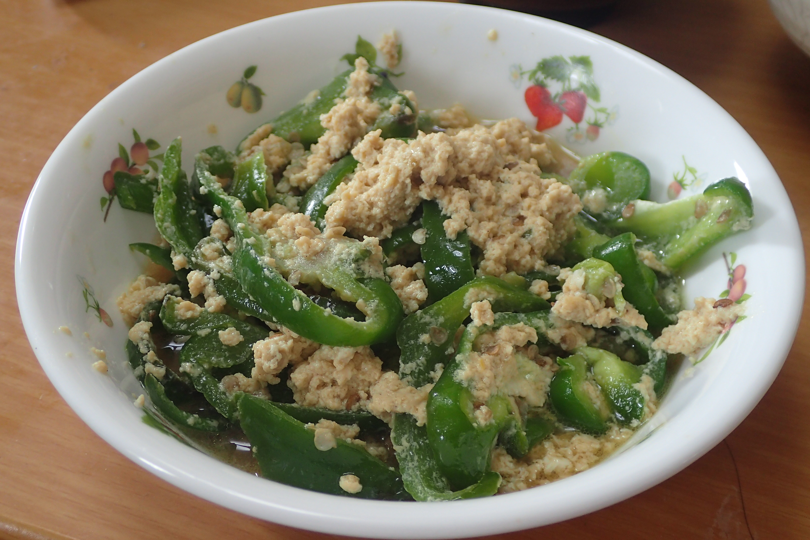

# ピーマンの玉子とじ

## 調理時間

30分くらい

## 元ネタ

* [ピーマンの玉子とじ レシピ・作り方 by liqueur｜楽天レシピ](https://recipe.rakuten.co.jp/recipe/1530003207/)

## 食材(1人前)

* ピーマン：2個
* 卵：一個
* だし汁
  * 醤油：大さじ1
  * 砂糖：少々
  * 顆粒だし：少々
  * 水：100cc(50ccくらいがよいかも)

## 調味料

* サラダ油：少々

## 調理機材

* フライパン
* まないたと包丁
* ボウル
* 計量カップ

## 手順

### 下準備

* 卵を溶いて、だし汁と混ぜておく
* ピーマンを2個とも細切りにしておく

### 調理手順

1. フライパンにサラダ油を敷き、ピーマンの細切りを中火で炒める
2. ピーマンが柔らかくなってきたら、溶いた卵をなるべく平らになるようにフライパンに注ぎ入れる
3. 卵が固まりはじめたくらいで火を止め、30秒ほど余熱で固める
4. 器によそってできあがり
