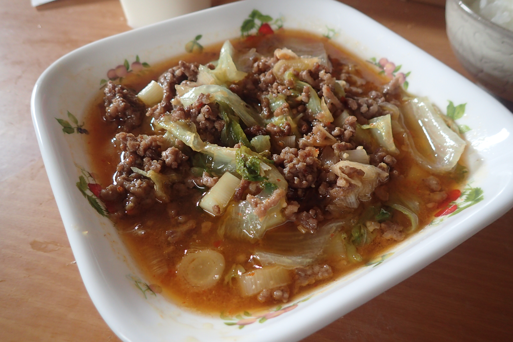

# 合い挽き肉とキャベツの回鍋肉風炒め(β)

## 調理時間

35分くらい

## 元ネタ

* [合挽き肉とキャベツの回鍋肉風炒め 作り方・レシピ \| 料理・レシピ動画サービスのクラシル](https://www.kurashiru.com/recipes/71488846-2c76-4211-977c-81e09f50d323)

## 食材(1人前)

* 合い挽き肉：150gほど
* キャベツ：3，4枚
* 長ネギ：2分の1本

## 調味料

* 調味料
  * 料理酒：大さじ2杯
  * 砂糖：大さじ2杯
  * みそ：大さじ1杯
  * オイスターソース：小さじ1杯
  * 醤油：小さじ1杯
  * 豆板醤：小さじ1杯
* ごま油：少々

## 調理機材

* フライパン
* まないたと包丁
* ボウル
* 計量カップ

## 手順

### 下準備

* キャベツを一口サイズに切り分ける
* 長ネギを1cm幅程度に斜め切りにする

### 調理手順

1. 中火で温めたフライパンに、ごま油を敷いて、合い挽き肉を入れ、炒める
2. 合い挽き肉の色が変わってきたら、キャベツと長ネギを加え、かき混ぜながら炒める。
3. 調味料を加え、かき混ぜて馴染ませる。馴染んだら火を止め、できあがり

## その他

1人前の場合、調味料は半分くらいの方がいいかも