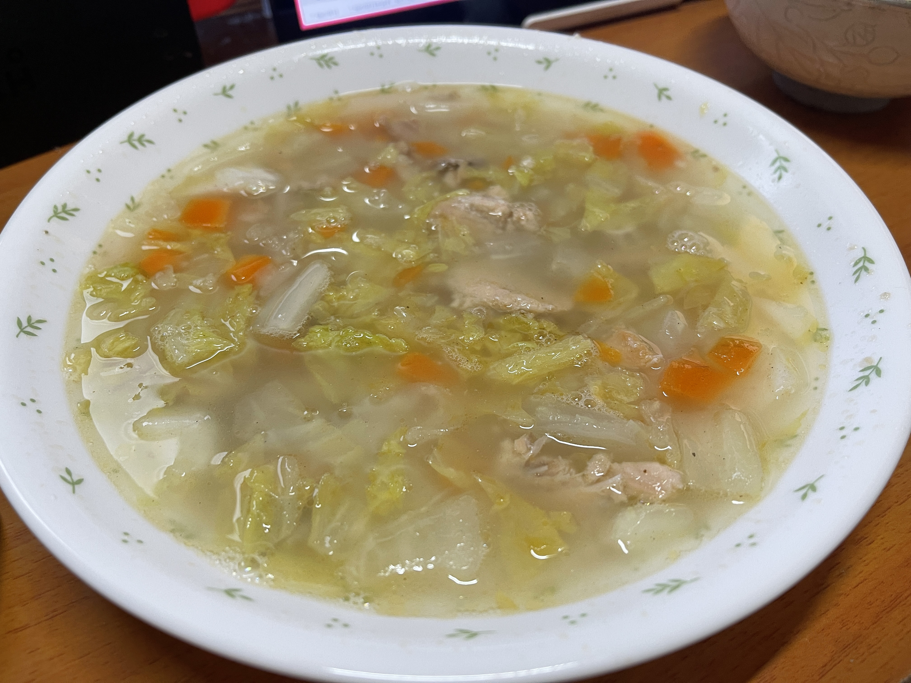

# 白菜と鮭のあっさりスープ

## 調理時間

1時間30分程度

## 元ネタ

* [ぽかぽか温まる★白菜たっぷりトロトロスープ レシピ・作り方 by カムトフニャンフニャン｜楽天レシピ](https://recipe.rakuten.co.jp/recipe/1720005438/)

## 食材(1.5人前)

* 白菜：1，2枚
* ニンジン：半分
* 鮭の中骨：1缶

## 調味料

* 生姜チューブ：少々
* 水：200cc
* 塩こしょう：ひとふり
* ごま油：少々

## 調理機材

* フライパン(蓋があるもの)
* まないた
* 包丁

## 手順

### 下準備

* 白菜、ニンジンを粗いみじん切りにする

### 調理手順

1. ごま油を敷いたフライパンを中火で温め、白菜、ニンジン、生姜チューブを炒める
2. 白菜が柔らかくなってきたら火を弱め、蓋をして5分ほど蒸らす
3. 水・塩こしょう・鮭の中骨缶を加え、2，30秒ほどかきまぜてできあがり

## メモ

* 水はもう少し少なくても良いかも
