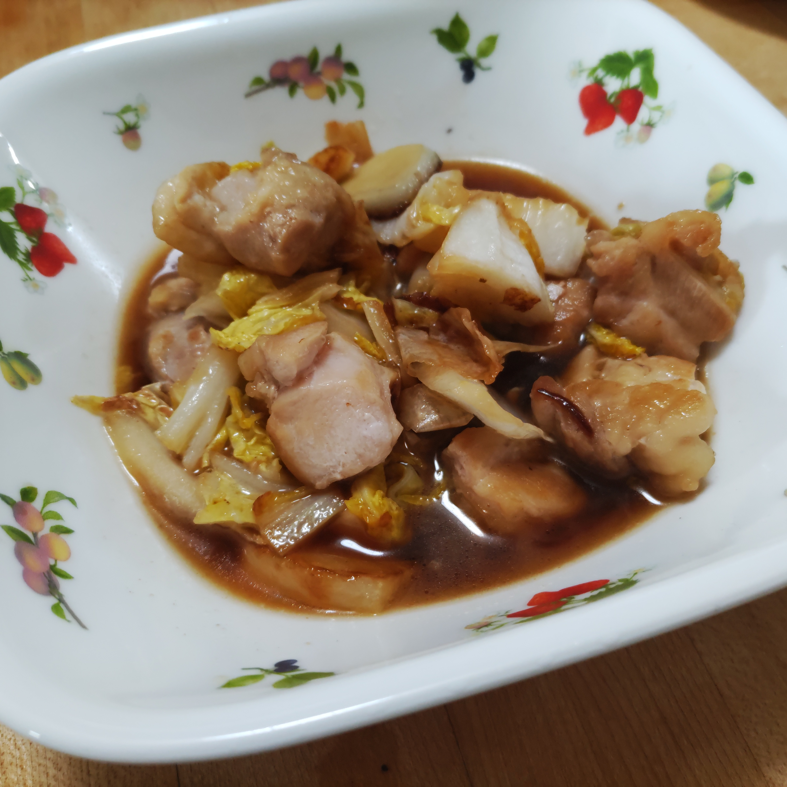

# 白菜と鶏肉のガリバタ炒め

## 調理時間

25分くらい

## 元ネタ

* [白菜と鶏もものガリバタ炒め 作り方・レシピ \| クラシル](https://www.kurashiru.com/recipes/fbf3ee96-0e02-4b53-b7cb-75d0f21f8f88)

## 食材(1人前)

* 鶏肉：100g
* 白菜：8分の1個
* にんにく：ひとかけ
* つゆ
  * 料理酒：30ml
  * みりん：30ml
  * しょうゆ：10ml
  * 砂糖：少々
  * 有塩バター：少々

## 調味料

* サラダ油

## 調理機材

* フライパン
* まな板と包丁 またはキッチンばさみとボウル

## 手順

### 下準備

* 鶏肉を食べやすいサイズに切り分ける
* 白菜を食べやすいサイズに切り分けるかちぎる
* にんにくを細かく切り分ける

### 調理手順

1. 中火であたためたフライパンににんにくをいれる
2. 香りがしてきたら、鶏肉を入れ、1分ほど炒める
3. 焼き色がついてきたら、鶏肉をひっくり返し、さらに1分ほど炒める
4. 白菜をくわえ、しんなりするまで炒める
5. 白菜がしんなりしてきたら、つゆを回し入れ、10秒ほどかき混ぜる
6. 味がしっかり馴染んできたらできあがり

## そのほか

つゆをご飯やパンにつけて食べる前提の量。つけない場合は少しつゆ少なめでもいいかも