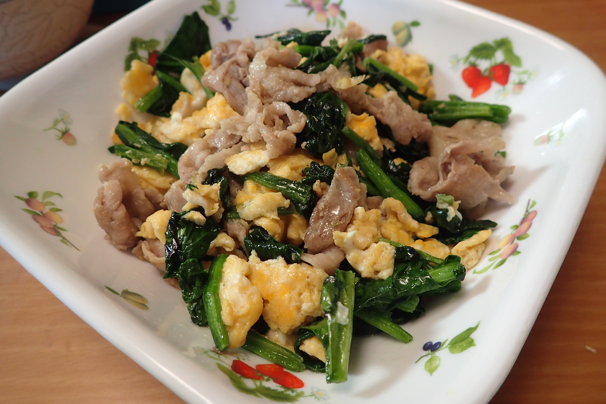

# 豚肉とほうれん草の卵炒め

## 調理時間

20分くらい

## 元ネタ

* [Cookpad](https://cookpad.com/recipe/5054673)

## 食材(1人前)

* 豚肉：100g前後
* ほうれん草：1～2本
* たまご:2個

## 調味料

* 塩こしょう：少々
* 醤油：小さじ一杯
* 料理酒：小さじ一杯
* 牛乳：大さじ一杯

## 調理機材

* フライパン
* まないた(包丁とまないたはほうれん草しか使わないので、キッチンバサミなどでも代用可能)
* 包丁
* 計量カップ

## 手順

### 下準備

* 豚肉を食べやすいサイズに切り分ける
  * 豚肉に塩こしょう少々と料理酒をまぶしておく
* 卵を溶き、塩こしょう・牛乳と混ぜる
* ほうれん草をざく切りにする

### 調理手順

1. フライパンにサラダ油を敷き、卵を中火で炒める
1. 卵が半熟になってきたら、火を止め皿に避ける
1. サラダ油を少し足し、豚肉を炒める
1. 豚肉の色が変わってきたら、ほうれん草と皿に避けた炒り卵を入れる
1. 醤油をかけたあと、少し炒めてできあがり
